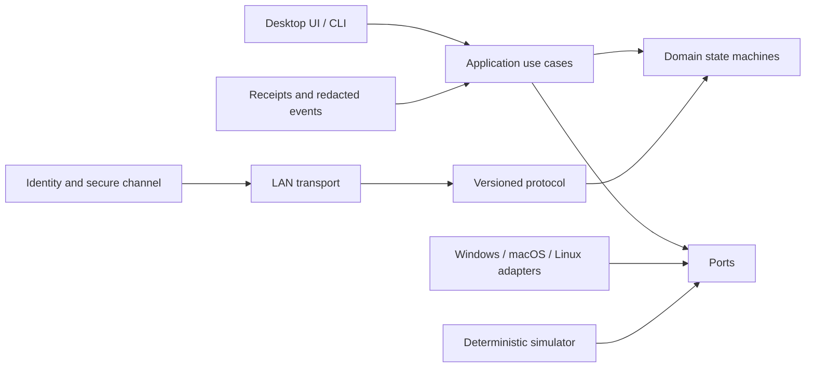
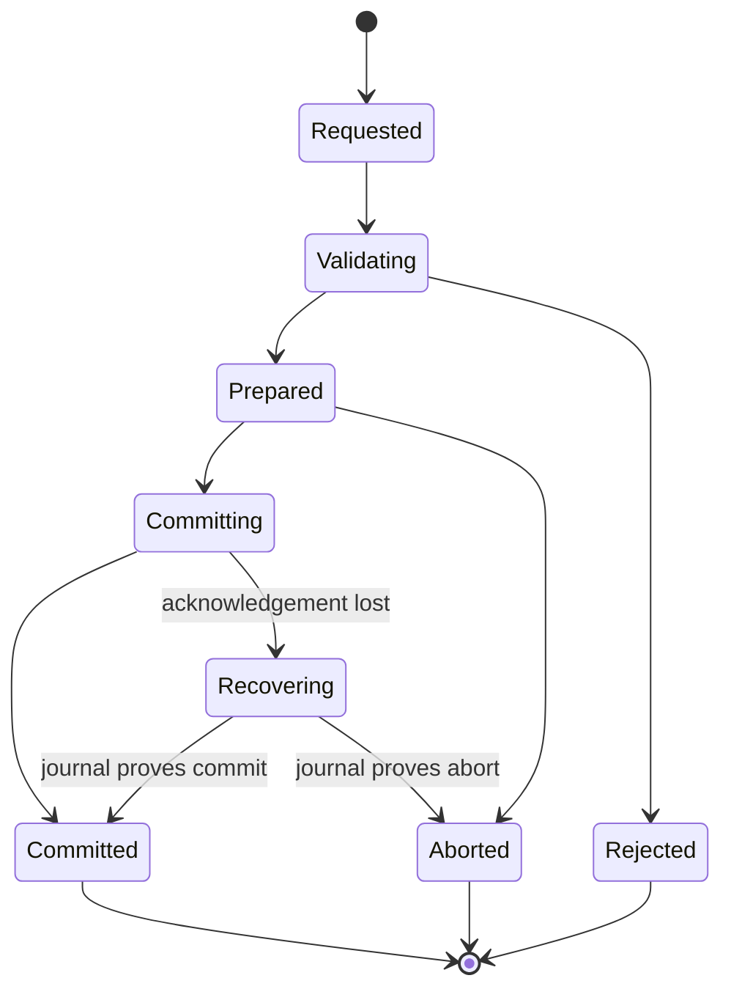

# Flowspan v1 Technical Design

Status: accepted baseline derived from approved product requirements

Requirements: `specs/v1/requirements.md`

## 1. Design principles

1. The domain core knows Activities and transactions, never windows or sockets.
2. Safety is monotonic: loss of certainty removes input/capture authority and
   never silently broadens a capability.
3. Semantic adapters are preferred; Remote Window is a named separate path.
4. Every remotely initiated change is authorized, idempotent, observable, and
   recoverable.
5. Platform APIs live behind narrow interfaces with deterministic fakes.
6. Direct LAN operation is complete without an online account. Relay is a
   future transport, not an assumption embedded in the protocol.

## 2. Technology baseline

Flowspan uses C# on .NET 10 LTS for the protocol, domain, services, platform
adapters, test utilities, and desktop shell. The headless core has no UI
dependency. The outer desktop composition project uses pinned Avalonia 12.1.0;
Avalonia types do not cross its boundary. See
`docs/adr/0001-dotnet-single-language.md`,
`docs/adr/0007-avalonia-desktop-shell.md`, and
`specs/v1/desktop-ui-design.md`.

Repository-wide settings pin nullable reference types, deterministic builds,
warnings as errors, analyzers, and a formatting check. Production core projects
use only the .NET base class libraries until an external dependency has an ADR.

## 3. System boundaries



Dependencies point inward. `Domain` has no filesystem, clock, randomness,
network, UI, or platform dependency. `Application` receives those facilities as
ports. Wire DTOs are translated at the protocol boundary rather than becoming
domain entities.

### Planned projects

| Project | Responsibility |
| --- | --- |
| `Flowspan.Domain` | Activities, capabilities, operations, swap state, driver leases, invariants |
| `Flowspan.Protocol` | Version envelopes, message DTOs, validation, negotiation, deterministic codec |
| `Flowspan.Application` | Handoff/move/swap/mirror use cases, authorization, journaling, recovery |
| `Flowspan.Security` | device identity, pairing transcript, key derivation, encrypted frames, trust store ports |
| `Flowspan.Transport` | framed connections, LAN discovery ports, reconnection/backoff |
| `Flowspan.Transport.Mdns` | isolated provisional Makaretu DNS-SD browser/publisher adapter |
| `Flowspan.Platform` | portable contracts and capability/degradation model |
| `Flowspan.Platform.Windows` | Windows-specific capture, input, protected-surface, credential-store implementations |
| `Flowspan.Platform.MacOS` | macOS-specific implementations and permission probes |
| `Flowspan.Platform.Linux` | Wayland-first portal and X11 fallback implementations |
| `Flowspan.Diagnostics` | structured events, receipts, redaction, export |
| `Flowspan.Simulator` | two-node executable and deterministic fault injection |
| `Flowspan.Desktop` | accessible desktop composition root and UI |

The first slice creates only the projects required to execute and test its
behavior. Empty platform assemblies are not created for appearance.

## 4. Core model

### Activity

An Activity has a stable ID, kind, origin device, current placement, lifecycle
state, sensitivity label, revision, and a validated descriptor. Descriptor
payloads are typed JSON objects with an adapter-owned schema identifier and
size limit. The generic core treats their contents as opaque after validation.

Initial semantic kinds:

- `web.page/v1`: canonical URL and optional title; target opens the URL using
  the user's selected/default browser.
- `file.reference/v1`: content digest, display name, media type, size, and an
  optional transfer offer; target never trusts a source path.
- `workspace.note/v1`: UTF-8 plain text with a conservative size limit, used by
  the simulator and as a portable reference adapter.

Remote Window is not an Activity descriptor kind. It is a presentation mode
whose host remains the source device.

### Operation lifecycle

Every request has `OperationId`, `CorrelationId`, initiator, participants,
deadline, requested capabilities, and expected Activity revisions.



Terminal outcomes are immutable. The operation journal provides idempotency;
the same operation ID and same request returns its stored outcome, while reuse
with different content is rejected as a conflict.

### Move and replace

A move captures and validates the source, prepares the target, commits target
resume, records acknowledgement, and only then asks the source adapter to close
or suspend. If source cleanup fails, the operation is `CommittedWithWarning`
and the receipt reports a duplicate Activity; target success is not rolled back
by destructively guessing.

Replace creates a bounded undo capsule through the target adapter before
commit. Adapters that cannot preserve enough state must say so before the user
confirms the replacement. The request binds the target Activity ID, expected
revision and descriptor digest as well as the incoming descriptor, Placement,
Operation/correlation, devices, and undo expiry. The current bounded retention
limit is 15 minutes. Full preserved state remains in a target-owned store; the
source receives only a payload-free capsule reference. Undo is local,
idempotent, expiry-checked, and restores a new Activity revision only if the
exact replacement is still current. See
`docs/adr/0011-bounded-replace-undo-capsule.md`.

Durable Replace state is one versioned target snapshot containing capsules,
Replace journal entries, undo journal entries, and consumption markers. The
platform boundary keeps a random 256-bit key in current-user OS credential
storage and uses AES-256-GCM for a bounded atomic local state file. A fresh
nonce and authenticated envelope detect corruption or replacement; decode
reconstructs descriptors and verifies their computed digests. The application
publishes its candidate snapshot only after the protected atomic save succeeds.

Both Replace and undo persist `Pending` before destructive Adapter work and a
terminal result afterward. Terminal exact retries replay across restart;
different request content conflicts. Startup recovery never guesses across a
persisted `Pending` boundary: it returns `Recovering` without another capture,
resume, restore, or catalog mutation. Undo completion stores its result and
capsule-consumption marker atomically. Expiry cleanup removes only unconsumed,
non-pending capsules whose retention deadline passed.

Replace target discovery is a purpose-scoped authenticated query, not a general
remote Activity browser. The source may query only while its current Trust
Record grants `activity.receive`; the target rechecks the requesting peer's
current `activity.replace` grant before reading inventory. An
`activity.replace.inventory` request binds correlation, target device,
incoming kind, and deadline. Its corresponding result binds the same fields and
capture time and contains at most 64 canonically Activity-ID-ordered target
snapshots. A snapshot contains target ID, positive revision, descriptor digest,
kind, normal-sensitivity title, and placement slot only. Descriptor payload,
payload digest, origin, sensitive/restricted Activities, inactive Activities,
non-local placements, different-kind Activities, and Activities without a
Replace-capable Adapter are not disclosed. Truncation is explicit and valid
only for a full 64-target page; rejected results contain neither targets nor
truncation. Capture time is
initialized, no later than the query deadline for success, and no later than
the authenticated result send time. A later Replace command still carries and
revalidates the selected ID/revision/digest, so inventory is never authority to
mutate stale state.

`activity.replace` joins `activity.offer` and `activity.receive` as an
independent any-of admission capability for the idle encrypted Activity control
channel. Admission grants no operation by itself: inventory and every later
operation recheck their exact current directional capability. The inventory
endpoint may be composed before the destructive Replace endpoint; desktop
Replace remains unavailable until preview, explicit confirmation,
receipt/recovery, and target-local undo surfaces are complete.

The desktop preview is a separate presentation state machine over the query-only
inventory port. `NotLoaded -> Loading -> Ready|Empty|Failed` owns a bounded,
payload-free collection. Selecting a source Activity or peer invalidates the
collection. A Ready choice creates a comparison view containing the incoming
title/kind and the target device, title, kind, placement, revision, and
descriptor digest. Confirmation is a local latch bound to that exact displayed
snapshot; every query, source/peer change, or target selection change clears it.
A refresh may preserve the selected ID for orientation only when revision and
digest are unchanged, but still requires confirmation again. A missing target
or changed revision/digest produces a named stale-preview state and no
destructive call. Query failures are mapped to bounded recovery guidance and
never expose exception, payload, or transport details. The completed 7.3c.4
preview-only slice exposed no `ReplaceAsync` desktop service method and composed
`AuthenticatedActivitySessionHandler` with `replacePeer: null`, so confirming a
preview could not cross the destructive boundary at that stage.

The target-local recovery surface reads a snapshot from the same protected
Replace store; it does not scrape logs or query a peer. The application projects
at most 64 canonically ordered records across Replace and undo journals. Each
record contains only its operation type, pending/terminal state, redacted reason,
known opaque operation/correlation/capsule/Activity/device IDs, known timestamp,
and exact capsule expiry/availability. A pending record created before capsule
capture may know only its Operation ID and is labelled as incomplete rather than
having participants inferred. Descriptor title, kind, digest, payload, preserved
state, request digest, and exception text never enter this read model. The
snapshot is immutable, explicitly marks truncation, and orders recovery-required
records before terminal history so a bounded page cannot hide an unresolved
boundary.

After identity and Trust make the Activity workspace available, Desktop startup
opens the protected Replace store as an independent failure domain. A key,
authentication, schema, bounds, or I/O failure becomes a named Replace-recovery
fault with platform-neutral guidance; normal note, Handoff, and Move work
remains available, while destructive Replace stays locked. The delivered 7.3c.5
projection remains an immutable read model and exposes no recovery retry. The
7.3c.6 composition added only target-local undo for a terminal committed Replace
item whose capsule is unconsumed and not expired; pending/expired/consumed states
never became actions. That slice still exposed no source-side `ReplaceAsync` or
production `IReplacePeer`; 7.3c.7 supplies both behind the existing gates.

The 7.3c.6 target-local undo composition must also prove that the capsule's
exact replacement is current after a Desktop restart. For the bounded
`workspace.note/v1` tracer only, the protected store is reduced to a terminal
state-transition graph: committed Replace records consume their captured
original instance and produce their exact replacement; committed undo records
consume that replacement and produce the restored descriptor at the next
revision. Only unambiguous graph frontiers for the local target may repopulate
the otherwise in-memory catalog. Any pending or `Recovering` Replace/undo
boundary suppresses restart reconstruction and every action because its side of
the destructive boundary is unknown. Conflicting transitions, participant or
receipt mismatches, orphaned capsules or committed receipts/undos, unsupported
kinds, and a catalog value other than the exact frontier fail closed rather than
being guessed.

An undo action is offered only when the selected recovery record names a
terminal committed Replace, its capsule has no prior undo attempt, remains
unexpired and unconsumed, and the catalog contains that exact replacement
instance. Selection or snapshot change clears the confirmation latch. The
confirmation names the capsule, both opaque Activity IDs, and exact expiry; the
operation publishes pending state before awaiting the application port, then
refreshes the same protected snapshot for every committed, rejected, failed, or
recovering outcome. A completed attempt is not silently converted into a new
operation. Desktop owns one private local `ReplaceEndpoint` so undo and the
future destructive target share the same serialization and durable journal. In
7.3c.6 the authenticated session handler still received `replacePeer: null` and
the source-side destructive command remained absent; 7.3c.7 changes that
composition only after the protected store opens successfully.

The Desktop service repeats the live eligibility check for callers that bypass
the ViewModel. An unknown capsule, unavailable recovery state, any global
pending/`Recovering` boundary, or an otherwise non-actionable exact-current
capsule is rejected before a new undo journal entry. Known expired, consumed, or
catalog-stale capsules still enter the core endpoint so it can return the exact
`UndoCapsuleExpired`, `UndoCapsuleConsumed`, or `RevisionConflict` reason without
performing Adapter restore work.

The 7.3c.7 production composition exposes that same private target endpoint to
authenticated Activity sessions only when the protected Replace store opens
successfully. A Trust-bound peer reloads the authenticated sender's current
peer-relative `activity.replace` for every destructive request and rejects a new
operation without another journal entry while any protected Replace/undo boundary
is pending or `Recovering`. A missing, corrupt, unsupported, or unreadable store
leaves inventory and non-Replace work available but composes no destructive
peer. Inbound Replace and target-local undo acquire the endpoint's shared
serialization boundary before either creates a persistent journal entry, so
concurrent authenticated sessions cannot overlap target-destructive pending
boundaries.

Source-side Desktop `ReplaceAsync` accepts the incoming Activity ID and the exact
confirmed target snapshot rather than a free-form command. It requires usable
local protected recovery, rechecks the current peer-relative `activity.receive`,
queries a fresh purpose-scoped inventory, and matches device, target ID,
revision, descriptor digest, kind, title, and placement. It then rechecks the
unchanged live incoming instance, local Trust, recovery state, and channel before
creating one new Operation/correlation pair and bounded undo expiry. A mismatch
returns named `RevisionConflict` before `activity.replace` is sent. The source
Activity is never removed by Replace.

An acknowledged response projects the authenticated receipt and payload-free
capsule reference. `NotDelivered` remains a local/pre-send result. Once the
destructive channel invocation begins, cancellation or an unexpected application
port failure is conservatively presented as acknowledgement loss: the target may
have committed, the source stays active, and Flowspan directs the user to target
recovery rather than inventing a new Operation ID or automatically retrying. The
Desktop command is disabled while pending; every terminal attempt revokes the
confirmation, a committed or send-time-stale snapshot clears the old inventory,
and keyboard/automation metadata exposes the command and bounded result fields.
The global safety band remains `NOT SHARING` because Replace is a one-shot
semantic operation, not Mirror or remote input.

This restart reduction is not a general Activity database and does not repeat
Adapter restore work. It can reconstruct the descriptor-complete semantic note
needed to check exact-current ownership during the capsule window; it does not
claim recovery of application process memory, unsaved external state, or an
unsupported Adapter.

Transfer, Replace inventory, and destructive Replace share one atomic pending
correlation reservation per authenticated session. A correlation ID cannot
identify two concurrent Activity operations even when their message types
differ; normal response, pre-send failure, and session loss all release the
reservation through the same lifecycle boundary.

### Atomic swap

Swap uses a coordinator plus durable endpoint journals:

1. validate identities, capability grants, expected revisions, and descriptor
   schemas;
2. prepare both endpoints and obtain expiring reservation tokens;
3. durably record the commit decision at the coordinator;
4. send commit with the decision digest to both endpoints;
5. retry until both acknowledge or recovery reads the decision record.

An endpoint never commits without a matching reservation and authenticated
commit decision created no later than the reservation deadline. Passing the
deadline forbids a new commit decision but does not let a prepared endpoint
guess `abort`: recovery must obtain the durable commit/abort decision. A timely
commit decision remains applicable if delivery arrives later. This blocking
trade-off preserves atomicity and is deliberately closer to a small two-phase
commit protocol than two independent moves.

The coordinator also persists a bounded, payload-free transaction intent before
the first Prepare can leave the process. That intent binds the Operation and
correlation IDs, deadline, both Device and Activity IDs, expected revisions and
descriptor digests, and the two device-bound reservation tokens. A reconstructed
intent with no decision is never resumed toward Commit: recovery first records a
durable Abort decision and then drives that decision to both participants. This
conservative rule covers cancellation, process termination, and decision-store
failure without guessing that no endpoint prepared.

Commit and Abort decisions bind each reservation token to its participant Device
ID and include the Abort reason in the decision digest. An endpoint accepts only
its own binding. An Abort that arrives before Prepare is an idempotent terminal
tombstone for that Operation and token, so a delayed or reordered Prepare cannot
reopen the transaction. A participant with an unresolved Prepared reservation
rejects another Operation for the same local Activity until the recorded decision
is applied.

The first durable-core slice persists coordinator intent and decision records in
a separate authenticated atomic file whose random key is held by DPAPI,
Keychain, or Secret Service. The endpoint durability slice adds one bounded,
Device-bound journal per participant. It persists the full original and incoming
Activity snapshots before returning Prepared, persists Commit or Abort before
catalog mutation or acknowledgement, and reduces Commit after restart only from
the exact original or exact already-replaced catalog state. The endpoint file
uses its own `FSEF` AES-256-GCM envelope, path, and DPAPI/Keychain/Secret Service
key purpose; an ambiguous save requires reopening before another write.
Every Prepared record reserves 1 KiB of the 4 MiB journal bound for its fixed-
shape terminal decision. Prepare rejects an incoming `long.MaxValue` revision,
so a durable Commit can always construct its checked successor rather than
becoming permanently unreducible after the decision write.

The Activity catalog remains an external authoritative Adapter boundary rather
than a general process-state database. Authenticated Swap protocol messages,
capability checks, and same-host encrypted-loopback composition are implemented
in the current transport slice. Desktop exact-confirmation and visible recovery,
durable Activity-catalog composition, physical two-device interruption, and
restart evidence are still required before the v1 Swap criterion can pass.

The authenticated transport slice replaces the in-process channel's synchronous
catalog peek with a bounded exact-snapshot request. It never exposes a list: the
request names one Activity ID and the result returns either one complete active,
normal-sensitivity snapshot or a structured rejection. The coordinator obtains
both exact snapshots before it writes intent, then sends Prepare and the durable
Commit/Abort decision through the same authenticated session abstraction.

Six control message types form three request/result pairs:
`activity.swap.snapshot`, `activity.swap.snapshot.result`,
`activity.swap.prepare`, `activity.swap.prepare.result`,
`activity.swap.decision`, and `activity.swap.decision.result`. Snapshot and
Prepare lifetimes are bounded by the Operation deadline and the five-minute
control-envelope maximum. Results and decision delivery use short envelopes;
a timely durable decision may be delivered after reservation expiry because the
endpoint validates the recorded decision time rather than its network arrival
time. Strict decoders reject unknown fields and recompute payload, descriptor,
request, and decision digests.

These types are a protocol 1.1 feature. Desktop discovery, pairing, and secure
session profiles advertise both 1.1 and 1.0, negotiate the highest exact common
version, and expose a Swap channel only for 1.1 or a later compatible minor in
major version 1. A 1.0 peer retains non-Swap control behavior; constructing or
decoding any Swap envelope at 1.0 fails closed. Six fixed-ID canonical frames,
their complete JSON, and SHA-256 hashes are committed as the 1.1 compatibility
fixture.

Every inbound Swap request or result is rejected at or after its authenticated
envelope `sentAt + ttlMs` before endpoint work or pending-result completion. A
durable decision that needs later recovery is sent in a fresh envelope; its
decision timestamp and digest remain unchanged.

Snapshot and Prepare sending plus response wait end at their
Operation/reservation deadline. Decision sending plus response wait use the same
30-second lifetime as the decision envelope. If an authenticated peer remains
connected but silent, the caller sees acknowledgement loss, the pending
correlation is released, and the session is closed so a late response cannot be
attached to later work. The receive path rechecks the current clock before
decoding a pending result, so timer scheduling delay cannot admit a response at
or after its deadline.
The send path races even a non-cooperative connection against the same injected-
clock deadline and observes any abandoned fault. Cleanup removes and releases a
correlation only through the exact pending-instance pair, preventing an older
send completion from releasing a newer cross-operation owner.

`activity.swap` is purpose-specific and does not follow from
`activity.replace`, `activity.offer`, or `activity.receive`. A current
peer-relative grant is required to disclose a snapshot or create a new
reservation. Once this endpoint has durably recorded the Operation, its exact
decision or terminal replay remains eligible after a later grant revocation only
when Operation ID, correlation ID, and authenticated peer Device all match the
record. The endpoint journal stores that binding in format v2 and rejects older
records that cannot prove it. Its strict decoder also rejects missing, null,
wrong-type, duplicated, or non-canonical binding fields. An exact Prepared
request replays before current deadline/grant checks; a new request still
requires current authority and active, normal-sensitivity Activities on the
exact local/peer placements. That narrow
post-revocation exception prevents one-sided revocation from blocking convergence
after Commit became durable. An unknown decision still requires the current
grant, preventing a previously paired but unauthorized peer from filling the
endpoint journal with Abort tombstones. Desktop exact confirmation and
destructive command exposure
remain disabled until their own slice; protocol availability alone is not user
authorization to initiate Swap.

### Mirror and driver lease

Mirror keeps authoritative execution on one host. Video/audio/cursor data are
separate bounded media channels; control messages use the reliable operation
channel. A driver lease includes Activity ID, holder device, monotonic epoch,
expiry, and permitted input classes. The host accepts input only for the highest
known unexpired epoch and revokes the old lease before issuing the next epoch.
Emergency stop increments the epoch, clears all leases, and closes media.

## 5. Protocol

The control protocol is framed canonical JSON for v1. Readability and fixture
stability outweigh wire density for low-volume control traffic. Binary media
and file content use separate chunk frames and never enter structured logs.

Each envelope includes:

```text
magic, protocolVersion, messageType, messageId, correlationId,
senderDeviceId, sentAt, ttl, bodyDigest, body
```

Decoders impose a maximum frame size, maximum nesting depth, known-version
range, strict required fields, and message-specific limits. Each schema defines
whether optional fields are allowed; safety-sensitive Swap schemas reject every
unknown field. Unknown message types and required capabilities are rejected.
Version negotiation precedes operation messages and chooses the highest common
major/minor feature set. See
`docs/adr/0002-versioned-local-protocol.md`.

## 6. Discovery, transport, and reconnection

The discovery boundary produces signed, short-lived peer offers containing
device ID, display name, protocol range, connection endpoint, nonce, and
identity-key fingerprint. No Activity names or capabilities are advertised.
`DnsSdDiscoveryOfferTxtCodec` carries the canonical bounded offer through
`_flowspan._tcp.local`; `DnsSdPeerConnectionCandidateSource` combines current
trust, the signed port, and concrete A/AAAA addresses. The provisional
`Flowspan.Transport.Mdns` adapter isolates Makaretu record types and rebuilds
its stack on outer network-address changes. `DnsSdPeerAdvertisementService`
publishes immediately, refreshes a 90-second signed offer every 45 seconds with
a fresh nonce, and withdraws on cancellation. The adapter replays the latest
accepted offer after stack replacement; refresh first sends a goodbye for the
old profile, so a short safe absence is possible. Physical LAN validation
remains open.

`IPeerTransport` exposes ordered duplex byte streams. Direct TCP is the initial
transport. A length-prefixed frame reader provides partial-read, size, timeout,
and cancellation handling. Reconnect uses bounded exponential backoff with
jitter supplied by an injectable source; trust is reauthenticated and active
capabilities are not assumed to survive a new secure session.

The R8.2 supervision slice keeps network observation and authenticated-session
creation behind narrow ports. `INetworkChangeSource` has a production adapter
over .NET's cross-platform network-address-change notification, while
`IAuthenticatedPeerSessionAttempt` represents exactly one fresh connection plus
authenticated session lifetime. An attempt reports transient connection failure,
authenticated-session end, or a permanent identity/policy/version rejection;
unexpected exceptions remain visible rather than being silently retried.

`PeerReconnectSupervisor` is a single serialized loop. A network change cancels
the current attempt or delay, coalesces event bursts, resets failure backoff, and
starts a fresh authenticated attempt only after the old attempt has drained.
Transient failures use bounded exponential backoff; an authenticated session
that later disconnects resets the failure count; permanent rejection ends the
loop. Caller cancellation cancels and awaits the active boundary operation and
removes the network-change subscription. Deterministic tests inject the attempt,
delay, jitter, and change source. Hosted tests prove this lifecycle contract,
not that a runner emitted or received a real DNS-SD record or survived physical
interface churn.

The next composition slice binds a resolved endpoint to the signed offer and
candidate public identity as one `VerifiedPeerConnectionCandidate`; the name
means the discovery adapter verified internal consistency, not that the peer is
trusted. Each `AuthenticatedTcpPeerSessionAttempt` reloads the current trust
record, checks the profile's explicit all-of or any-of Capability requirement,
verifies the candidate against that trust and current UTC, and only then opens
TCP. Missing/expired candidates are
transient; absent trust, identity change, capability denial, incompatible
protocol, and authentication failure are structured permanent stop reasons.

After the signed TCP handshake, protocol 1.2 derives its directional AEAD keys
but does not expose a control channel yet. The initiator sends an encrypted
role/transcript/session-bound Finished at epoch 1, sequence 0; the responder
verifies it before returning its own Finished at its sequence 0. Only then does
the attempt register its live control session through `TrustSessionCoordinator`
and hand the connection to the injected control session handler, so the first
control message in either direction uses sequence 1. Protocol 1.0/1.1 retain a
named legacy four-message compatibility path; the signed highest-common-version
transcript prevents removal of mutually offered 1.2 without signature failure.
While such a legacy session is active, the desktop connection snapshot names
`LEGACY COMPATIBILITY` and explains that encrypted Finished is absent; it must
not present the same security status as a protocol-1.2 session.
Malformed, substituted, tampered, missing, or late Finished closes before
registration.

Registration failure closes the connection without exposing a session. Peer
revocation, capability downgrade, supervisor/network cancellation, or local
shutdown cancels the handler and disposes the connection; a later supervisor
iteration performs a new discovery/trust lookup and handshake. Tests use signed
candidates and real loopback TCP for the success path while faulting the ports at
the Finished, trust, registration, handler, and cancellation boundaries.

The inbound side accepts multiple paired peers through one TCP listener. The
initiator's claimed Device ID is parsed from the first bounded hello only to
select a current `TrustRecord`; it is unauthenticated routing input and grants no
authority. An unknown claim is closed before Flowspan responds. The normal hello
decoder then requires the Device ID and fingerprint to match the selected trust
record, and the transcript signature proves possession of that record's identity
key. Immediately before capability registration, the listener reloads current
trust and compares the authenticated key again, closing the handshake-to-register
race.

`AuthenticatedTcpInboundListener` acquires a bounded slot before accept and keeps
it for the handshake and registered session lifetime. The default limit is 32
slots and configuration cannot exceed 128. Authentication or capability denial
affects only that peer; handler failures are reported as structured diagnostics
without stopping other sessions. Peer revocation or capability downgrade drains
the affected registered session, while listener cancellation or a fatal accept
failure cancels and awaits every active session before returning. Injected
acceptor/session ports make these lifecycle and failure paths deterministic in
tests. The real-network integration test uses two clients on the same process's
loopback interface; it is not physical-device or multicast evidence.

That reconnect-composition slice did not publish or resolve DNS-SD records. The
subsequent DNS-SD slices resolve bounded SRV/TXT/A/AAAA observations into the
same candidate source and publish minimized signed offers through the isolated
adapter. These are lifecycle and contract tests; they do not prove physical
multicast behavior.

The desktop 7.2d composition owns trusted reconnect only while the owner has
explicitly enabled the same local-network lifetime used for pairing. For each
trusted peer with at least one local `activity.offer`, `activity.receive`,
`activity.replace`, `activity.swap`, `mirror.view`, or `mirror.drive` grant, the
lexicographically smaller Device ID is the sole active connector and the other
endpoint waits on the shared authenticated listener. The any-of profile grants
only an authenticated idle channel; each Activity or Remote Window boundary
still rechecks its exact current purpose and direction, and `mirror.drive`
without `mirror.view` never qualifies a Mirror target or participant.
This deterministic ownership prevents two healthy peers from maintaining
duplicate symmetric idle connections. Discovery changes wake a waiting retry
loop but do not tear down an already authenticated session merely because an
unverified conflicting advertisement appeared. ADR 0008 records the election,
authorization boundary, alternatives, and revisit triggers.

The desktop reconnect projection is per Trust Record, not a global Connected
flag. Candidate lookup reconstructs the peer public identity only from the
current Trust Record and verifies the signed, unexpired offer before TCP is
opened. It projects waiting, authenticating, authenticated-idle, bounded retry,
and permanent rejection. `AUTHENTICATED — IDLE / NOT SHARING` means only that a
fresh encrypted control channel passed identity and capability registration;
it does not describe a live Mirror or remote-input session. Revocation,
capability downgrade, local network disable, and window close cancel and drain
the corresponding supervisor or registered handler before its owners are
disposed.

A DNS-SD record that claims a trusted Device ID with a different fingerprint is
never supplied to the connector. The desktop latches a prominent warning for
the current explicitly enabled network lifetime, shows the trusted fingerprint
beside the conflicting advertised fingerprint, and says that discovery alone
does not prove possession of the conflicting key. A transcript authentication
failure that resolves to `CandidateIdentityChanged` is also a permanent warning
even when no safe observed fingerprint is available. Trust is never replaced or
repaired automatically.

The desktop 7.3a vertical slice attaches one `AuthenticatedActivitySessionHandler`
to both elected outgoing and shared incoming control paths. It admits the
reusable channel when the local Trust Record has `activity.offer` **or**
`activity.receive`; legacy profiles continue to require all listed Capabilities.
`TrustSessionCoordinator` records the match mode so a partial downgrade of an
any-of session keeps it alive while removal of the final alternative drains it.
Duplicate authenticated Activity sessions for one Device ID are rejected.

An outbound `workspace.note/v1` Handoff is separately authorized immediately
before disclosure: the source's local Trust Record must grant its target
`activity.receive`. The target binds the authenticated sender to its current
Trust Record and requires `activity.offer` before adapter use. The encrypted
`activity.transfer` body carries exact, bounded descriptor fields plus operation,
placement, deadline, request, payload, and descriptor digests. Decoding rejects
unknown/missing fields, participant mismatch, unsupported kind, digest mismatch,
or a deadline outside the authenticated envelope. The target's payload-free
receipt is bound to the authenticated participants, protocol, correlation ID,
Operation ID/kind, Activity ID/kind, and descriptor digest. Unknown message types,
unsolicited or mismatched receipts, and duplicate peer sessions fault closed.
Disconnect after send but before a verified receipt produces
`AcknowledgementLost`, leaving the source active.

The desktop 7.3b slice reuses that authenticated transfer for bounded
`workspace.note/v1` Move. The target must resume and return the same precisely
bound, payload-free receipt before the source adapter is asked to close. A
rejected transfer, delivery failure, or missing acknowledgement keeps the source
active. A source-close failure does not roll back the acknowledged target; it is
`CommittedWithWarning / SourceCleanupFailed` and may leave two active copies.
Only an exactly `Committed` result removes the source from the desktop's active
Activity projection. Move uses the same source-side `activity.receive` and
target-side `activity.offer` authorization as Handoff.

Production startup orders protected identity, persistent Trust, then Activity
runtime. Local network shutdown drains control sessions before the Activity
handler, Trust, and identity are disposed. A failed Activity startup can be
retried without reopening already-ready identity or Trust dependencies.

## 7. Identity, pairing, and encryption

Each device owns a long-lived P-256 ECDSA identity key stored via an
`ISecretStore`. Pairing exchanges public keys over an unauthenticated candidate
channel, signs the transcript, and displays a short authentication string
derived from the full transcript. Trust is persisted only after local
confirmation on both endpoints.

The headless pairing ceremony runs over an injected bounded message channel;
direct TCP supplies one adapter while deterministic tests supply another. The
initiator and responder exchange canonical `FSP1` hellos containing only role,
public identity, a fresh 32-byte nonce, and 1–16 supported protocol versions.
They select the highest common version, build the role-ordered transcript, and
exchange transcript-hash signatures before either endpoint asks for user
confirmation. A default two-minute whole-ceremony deadline may be configured up
to ten minutes and covers network I/O, confirmation, and trust persistence.

`IPairingDecisionSource` receives the peer identity, six-digit SAS, and expiry.
Its local decision contains accept/reject plus the Capabilities this device will
grant that peer; grants are local authority and are not advertised by the peer.
Signed confirmations are exchanged concurrently so an early peer rejection can
cancel a still-pending local prompt. After two valid acceptances, each side signs
a distinct completion proof stating that it verified the peer's confirmation;
the initiator proof precedes the responder proof. Only both valid completion
proofs allow local `ITrustStore` registration. Reject, timeout, no common version,
malformed or invalid signature/confirmation/completion, and an existing
Device-ID/key conflict create no new local Trust Record. Same-key
`AlreadyTrusted` is explicit and never silently updates grants. Storage failure
remains visible rather than being reported as a successful pairing.

The first transport slice exposes an explicit direct-TCP pairing channel. It is
one-shot and is closed on every outcome; no Activity or control message can reuse
the unauthenticated pairing socket. A successful pair must reconnect and complete
the normal authenticated ephemeral handshake against persisted trust.

The production listener-composition slice keeps one published TCP endpoint and
makes the first bounded hello an explicit protocol-family selector: only canonical
pairing hello envelopes (`FSP1`, kind 1) and authenticated-session hello
envelopes (`FSH1`, kind 1) are routed. Wrong kinds, unknown magic, oversized
frames, and selection timeout close only that connection. The selector consumes
the first frame once and transfers it with exclusive connection ownership to the
chosen decoder, preventing cross-protocol replay or a second interpretation.
Pairing and authenticated sessions have independent concurrency limits inside a
hard total-connection limit, so a pending confirmation prompt does not serialize
all trusted peers. Pairing always closes its socket; success therefore requires a
new connection through the authenticated branch before Activity traffic.
Listener cancellation or fatal accept failure cancels and awaits both kinds of
in-flight work. Pairing Trust registration is serialized through the same
`TrustSessionCoordinator` gate as revocation, capability mutation, and session
admission, so listener composition cannot bind pairing and authentication to
different authorities or re-add trust across a concurrent revoke. Task 7.2a
bridges this decision port to a least-privilege desktop SAS confirmation surface
and proves it with two loopback nodes. Production listener/discovery composition
and physical two-person SAS evidence remain separate work.

The desktop network-entry slice makes that composition explicitly user enabled.
It opens one dual-stack listener before signing its advertised port, then owns a
single browser/publisher, refresh loop, unified inbound listener, and outbound
pairing initiator under one cancellable lifetime. These components borrow the
already loaded `DeviceIdentity` and `TrustSessionCoordinator`; shutdown drains
the network lifetime before either authority is disposed.

The listener and advertisement loops are supervised as one session failure
domain after startup. Either loop ending unexpectedly atomically marks the
session faulted, cancels the shared lifetime, and stops the bound socket. The
desktop runtime removes that session before publishing a sanitized retryable
fault and drains withdrawal, browser disposal, the listener, and any admitted
pairing. This prevents an enabled UI from outliving its network loops; retry
always creates a new endpoint, DNS-SD adapter, and signed advertisement.

An unpaired DNS-SD record is structurally bounded but not cryptographically
verified because the public identity key is not advertised. Presentation and
domain types therefore call it an `UnverifiedPairingCandidate`. An initiating
ceremony wraps the normal decision source with a discovery-binding decision
source. That wrapper compares the transcript-authenticated peer Device ID and
fingerprint with the pinned offer and verifies the offer signature and lifetime
using the authenticated public key before it allows the SAS prompt. This is the
only transition from unverified discovery metadata to a pairing decision.
Already-trusted Device IDs with another fingerprint are blocked as identity
changes and never enter re-pairing.

The unverified-candidate projection rejects self, malformed, expired,
future-skewed, port-inconsistent, non-concrete, loopback, and multicast input.
Service removal deletes its candidates immediately. Each read drops expired
offers, reloads Trust classification, and returns an immutable total order by
Device ID, address family and bytes, port, service instance, and offer digest;
browser callback or dictionary insertion order is never presentation state.

Each connection performs ephemeral P-256 ECDH, authenticates its transcript
with the paired identity keys, derives directional AES-256-GCM keys using
HKDF-SHA-256, and assigns monotonically increasing nonces. Headers needed for
routing are authenticated as associated data. Key epochs rotate before nonce
or byte limits and old epochs are erased. Protocol 1.3 carries a bounded `FSR1`
traffic-key update under the retiring directional key, derives the next key from
that key plus session/direction/epoch context, and resets only that direction to
sequence zero. A request bit asks the peer to reach the same target epoch;
crossed requests suppress a redundant response when the local send direction
already reached that target. Protocol 1.2 retains Finished and reconnects at the
usage bound, while 1.0/1.1 retain their legacy warning. This application layer
keeps payloads end-to-end protected when a future byte-forwarding relay is
introduced.

Cryptographic formats, limits, and test vectors must be frozen in a dedicated
security ADR before production pairing is enabled. The first simulator slice
uses an explicit fake secure channel and cannot be presented as production
security.

## 8. Authorization and sensitive surfaces

Authorization evaluates peer identity, capability, direction, Activity scope,
sensitivity, current secure-session identity, and local platform state. Default
capabilities are denied. Suggested independent grants are:

`activity.offer`, `activity.receive`, `activity.replace`, `activity.swap`,
`mirror.view`, `mirror.drive`, `file.receive`, and `scene.apply`.

Capabilities are local grants to the peer named by a Trust Record.
`activity.offer` permits that peer to send an Activity to this device;
`activity.receive` permits this device to disclose and send an Activity to that
peer. Transport admission may use an explicit any-of set for a bidirectional
control channel, but that never substitutes for the operation-direction check.

All product trust mutations and active peer-session registrations pass through
one coordinator boundary. Revocation or capability downgrade first removes the
trust/session eligibility under the same lock, then invokes every affected
session stop outside the lock before returning. A stop failure is reported only
after all affected sessions have received a stop request. This ordering prevents
a concurrent session from being admitted with revoked authority. The coordinator
accepts the `ITrustStore` authority; both the degraded in-memory store and the
payload-backed persistent implementation stay behind this boundary rather than
exposing an independent product mutation path. Local coordinator shutdown first
blocks new admission, removes every registration, and awaits all session stops.

The desktop trust workspace reads an immutable, canonically Device-ID-ordered
`TrustedPeerSnapshot` projection from this same authority. The projection
contains only the peer ID, display name, identity fingerprint, verification
time, and immutable Capability grant; it does not expose repository mutation or
public-key bytes to presentation code. Desktop capability changes and peer
revocation carry both the Device ID and the fingerprint shown to the user. The
coordinator applies them only if that identity is still current, so a stale UI
cannot change or remove a newly replaced identity. After every mutation attempt,
the desktop refreshes from the authoritative snapshot rather than editing its
local collection optimistically.

Only the coordinator's typed post-commit `TrustSessionStopException` can map to
an `AppliedWithSessionStopFailure` desktop result. Storage, codec, cancellation,
and other aggregate failures remain failed mutations and cannot be inferred as
success from a coincidentally matching snapshot. The persistent desktop
authority serializes each complete open/read/mutate/register operation with
disposal; closing rejects new work and waits for an operation already admitted
to leave the authority before disposing its coordinator and repository.

Platform adapters continuously expose a `ProtectionState`. Unknown or stale
protection state fails closed for capture and remote input. The global emergency
stop is implemented in the platform process as well as the application layer so
it does not depend on a healthy peer or UI event loop.

## 9. Persistence and diagnostics

ADR 0006 replaces the provisional plain-JSON trust plan with a bounded,
canonical binary snapshot behind `ITrustStore` and `ITrustPayloadStore`. A
mutation is published in memory only after the opaque platform-protected payload
has been atomically replaced; corrupt or unsupported startup data fails closed.
The core codec and repository are implemented, while Windows, macOS, and Linux
trust-payload adapters remain explicit platform gates. Private keys never use
this trust repository. Activity history and Scene persistence still require a
separate format/migration decision before production use.

Domain transitions emit structured events with stable event IDs and reason
codes. Redaction happens before sinks receive fields. Receipts and diagnostics
contain hashes, sizes, kinds, and state transitions—not descriptor payloads,
raw keystrokes, filenames marked sensitive, or key material.

## 10. Desktop and platform plan

- **Windows**: Windows Graphics Capture for output where available, SendInput
  only under an active driver lease, UI Automation/accessibility adapters, and
  Windows Credential Manager/DPAPI for secrets. Secure desktop and protected
  content fail closed.
- **macOS**: ScreenCaptureKit, accessibility permission for input, Keychain for
  secrets, and secure-input/protected-window probes. Permissions are requested
  at feature use.
- **Linux**: Wayland via xdg-desktop-portal/PipeWire and RemoteDesktop portal;
  X11 is an explicit weaker fallback. Secret Service stores identity material.
  Desktop/portal differences are reported as capabilities, not hidden.

Platform calls are thin adapters. Contract tests run everywhere; native tests
are tagged and executed only on the matching CI runner or documented manual
hardware environment.

The first progressive-permission slice is the local-network preflight because
that is the first currently implemented feature that can trigger an operating-
system or firewall decision. A pure platform-family selector supplies bounded
Windows, macOS, or Linux guidance; it never probes or requests permission.
Review and cancel are side-effect free. Only an affirmative acknowledgement can
call the existing explicitly enabled network runtime, and Disable returns the
surface to a state that requires a new review. Screen-capture and remote-input
permission requests remain separate feature-use slices; their absence is named
rather than represented as granted.

## 11. Verification

The deterministic simulator supplies fake clock, IDs, transport, adapters,
journal, trust store, and fault schedule. The first slice must demonstrate:

1. semantic handoff between two nodes;
2. move closes source only after target acknowledgement;
3. lost acknowledgement is safely retried;
4. duplicate requests do not duplicate Activities;
5. swap failure before decision changes neither endpoint;
6. recorded commit recovers after disconnect;
7. expired driver leases reject input;
8. structured receipts omit descriptor content.

Full layers and CI evidence are defined in `docs/testing/test-strategy.md` and
`docs/release/v1-release-criteria.md`.

## 12. Open implementation decisions

These do not alter the approved product direction and will be resolved by
spikes/ADRs:

- the physical-test trigger for replacing the provisional managed DNS-SD
  adapter with native adapters;
- packaging/signing pipeline for the pinned Avalonia desktop shell;
- per-platform Remote Window codec and capture implementation;
- long-term history pruning after the bounded protected Replace snapshot and
  15-minute capsule cleanup policy; Activity descriptor size budgets are
  already bounded by the core and each Adapter.
