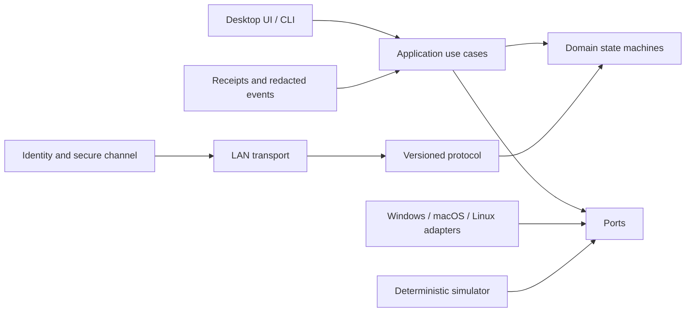
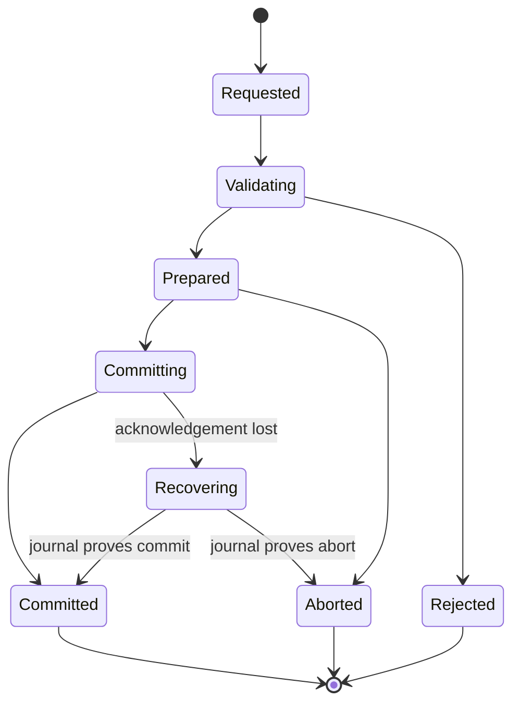

# Flowspan v1 Technical Design

Status: accepted baseline derived from approved product requirements

Requirements: `specs/v1/requirements.md`

## 1. Design principles

1. The domain core knows Activities and transactions, never windows or sockets.
2. Safety is monotonic: loss of certainty removes input/capture authority and
   never silently broadens a capability.
3. Semantic adapters are preferred; Remote Window is a named separate path.
4. Every remotely initiated change is authorized, idempotent, observable, and
   recoverable.
5. Platform APIs live behind narrow interfaces with deterministic fakes.
6. Direct LAN operation is complete without an online account. Relay is a
   future transport, not an assumption embedded in the protocol.

## 2. Technology baseline

Flowspan uses C# on .NET 10 LTS for the protocol, domain, services, platform
adapters, test utilities, and desktop shell. The headless core has no UI
dependency. The outer desktop composition project uses pinned Avalonia 12.1.0;
Avalonia types do not cross its boundary. See
`docs/adr/0001-dotnet-single-language.md`,
`docs/adr/0007-avalonia-desktop-shell.md`, and
`specs/v1/desktop-ui-design.md`.

Repository-wide settings pin nullable reference types, deterministic builds,
warnings as errors, analyzers, and a formatting check. Production core projects
use only the .NET base class libraries until an external dependency has an ADR.

## 3. System boundaries



Dependencies point inward. `Domain` has no filesystem, clock, randomness,
network, UI, or platform dependency. `Application` receives those facilities as
ports. Wire DTOs are translated at the protocol boundary rather than becoming
domain entities.

### Planned projects

| Project | Responsibility |
| --- | --- |
| `Flowspan.Domain` | Activities, capabilities, operations, swap state, driver leases, invariants |
| `Flowspan.Protocol` | Version envelopes, message DTOs, validation, negotiation, deterministic codec |
| `Flowspan.Application` | Handoff/move/swap/mirror use cases, authorization, journaling, recovery |
| `Flowspan.Security` | device identity, pairing transcript, key derivation, encrypted frames, trust store ports |
| `Flowspan.Transport` | framed connections, LAN discovery ports, reconnection/backoff |
| `Flowspan.Transport.Mdns` | isolated provisional Makaretu DNS-SD browser/publisher adapter |
| `Flowspan.Platform` | portable contracts and capability/degradation model |
| `Flowspan.Platform.Windows` | Windows-specific capture, input, protected-surface, credential-store implementations |
| `Flowspan.Platform.MacOS` | macOS-specific implementations and permission probes |
| `Flowspan.Platform.Linux` | Wayland-first portal and X11 fallback implementations |
| `Flowspan.Diagnostics` | structured events, receipts, redaction, export |
| `Flowspan.Simulator` | two-node executable and deterministic fault injection |
| `Flowspan.Desktop` | accessible desktop composition root and UI |

The first slice creates only the projects required to execute and test its
behavior. Empty platform assemblies are not created for appearance.

## 4. Core model

### Activity

An Activity has a stable ID, kind, origin device, current placement, lifecycle
state, sensitivity label, revision, and a validated descriptor. Descriptor
payloads are typed JSON objects with an adapter-owned schema identifier and
size limit. The generic core treats their contents as opaque after validation.

Initial semantic kinds:

- `web.page/v1`: canonical URL and optional title; target opens the URL using
  the user's selected/default browser.
- `file.reference/v1`: content digest, display name, media type, size, and an
  optional transfer offer; target never trusts a source path.
- `workspace.note/v1`: UTF-8 plain text with a conservative size limit, used by
  the simulator and as a portable reference adapter.

Remote Window is not an Activity descriptor kind. It is a presentation mode
whose host remains the source device.

### Operation lifecycle

Every request has `OperationId`, `CorrelationId`, initiator, participants,
deadline, requested capabilities, and expected Activity revisions.



Terminal outcomes are immutable. The operation journal provides idempotency;
the same operation ID and same request returns its stored outcome, while reuse
with different content is rejected as a conflict.

### Move and replace

A move captures and validates the source, prepares the target, commits target
resume, records acknowledgement, and only then asks the source adapter to close
or suspend. If source cleanup fails, the operation is `CommittedWithWarning`
and the receipt reports a duplicate Activity; target success is not rolled back
by destructively guessing.

Replace creates a bounded undo capsule through the target adapter before
commit. Adapters that cannot preserve enough state must say so before the user
confirms the replacement.

### Atomic swap

Swap uses a coordinator plus durable endpoint journals:

1. validate identities, capability grants, expected revisions, and descriptor
   schemas;
2. prepare both endpoints and obtain expiring reservation tokens;
3. durably record the commit decision at the coordinator;
4. send commit with the decision digest to both endpoints;
5. retry until both acknowledge or recovery reads the decision record.

An endpoint never commits without a matching reservation and authenticated
commit decision created no later than the reservation deadline. Passing the
deadline forbids a new commit decision but does not let a prepared endpoint
guess `abort`: recovery must obtain the durable commit/abort decision. A timely
commit decision remains applicable if delivery arrives later. This blocking
trade-off preserves atomicity and is deliberately closer to a small two-phase
commit protocol than two independent moves.

### Mirror and driver lease

Mirror keeps authoritative execution on one host. Video/audio/cursor data are
separate bounded media channels; control messages use the reliable operation
channel. A driver lease includes Activity ID, holder device, monotonic epoch,
expiry, and permitted input classes. The host accepts input only for the highest
known unexpired epoch and revokes the old lease before issuing the next epoch.
Emergency stop increments the epoch, clears all leases, and closes media.

## 5. Protocol

The control protocol is framed canonical JSON for v1. Readability and fixture
stability outweigh wire density for low-volume control traffic. Binary media
and file content use separate chunk frames and never enter structured logs.

Each envelope includes:

```text
magic, protocolVersion, messageType, messageId, correlationId,
senderDeviceId, sentAt, ttl, bodyDigest, body
```

Decoders impose a maximum frame size, maximum nesting depth, known-version
range, strict required fields, and message-specific limits. Unknown optional
fields are ignored; unknown message types and required capabilities are
rejected. Version negotiation precedes operation messages and chooses the
highest common major/minor feature set. See
`docs/adr/0002-versioned-local-protocol.md`.

## 6. Discovery, transport, and reconnection

The discovery boundary produces signed, short-lived peer offers containing
device ID, display name, protocol range, connection endpoint, nonce, and
identity-key fingerprint. No Activity names or capabilities are advertised.
`DnsSdDiscoveryOfferTxtCodec` carries the canonical bounded offer through
`_flowspan._tcp.local`; `DnsSdPeerConnectionCandidateSource` combines current
trust, the signed port, and concrete A/AAAA addresses. The provisional
`Flowspan.Transport.Mdns` adapter isolates Makaretu record types and rebuilds
its stack on outer network-address changes. `DnsSdPeerAdvertisementService`
publishes immediately, refreshes a 90-second signed offer every 45 seconds with
a fresh nonce, and withdraws on cancellation. The adapter replays the latest
accepted offer after stack replacement; refresh first sends a goodbye for the
old profile, so a short safe absence is possible. Physical LAN validation
remains open.

`IPeerTransport` exposes ordered duplex byte streams. Direct TCP is the initial
transport. A length-prefixed frame reader provides partial-read, size, timeout,
and cancellation handling. Reconnect uses bounded exponential backoff with
jitter supplied by an injectable source; trust is reauthenticated and active
capabilities are not assumed to survive a new secure session.

The R8.2 supervision slice keeps network observation and authenticated-session
creation behind narrow ports. `INetworkChangeSource` has a production adapter
over .NET's cross-platform network-address-change notification, while
`IAuthenticatedPeerSessionAttempt` represents exactly one fresh connection plus
authenticated session lifetime. An attempt reports transient connection failure,
authenticated-session end, or a permanent identity/policy/version rejection;
unexpected exceptions remain visible rather than being silently retried.

`PeerReconnectSupervisor` is a single serialized loop. A network change cancels
the current attempt or delay, coalesces event bursts, resets failure backoff, and
starts a fresh authenticated attempt only after the old attempt has drained.
Transient failures use bounded exponential backoff; an authenticated session
that later disconnects resets the failure count; permanent rejection ends the
loop. Caller cancellation cancels and awaits the active boundary operation and
removes the network-change subscription. Deterministic tests inject the attempt,
delay, jitter, and change source. Hosted tests prove this lifecycle contract,
not that a runner emitted or received a real DNS-SD record or survived physical
interface churn.

The next composition slice binds a resolved endpoint to the signed offer and
candidate public identity as one `VerifiedPeerConnectionCandidate`; the name
means the discovery adapter verified internal consistency, not that the peer is
trusted. Each `AuthenticatedTcpPeerSessionAttempt` reloads the current trust
record, checks required capabilities, verifies the candidate against that trust
and current UTC, and only then opens TCP. Missing/expired candidates are
transient; absent trust, identity change, capability denial, incompatible
protocol, and authentication failure are structured permanent stop reasons.

After the TCP handshake, the attempt registers its live control session through
`TrustSessionCoordinator` before handing the connection to the injected control
session handler. Registration failure closes the connection without exposing a
session. Peer revocation, capability downgrade, supervisor/network cancellation,
or local shutdown cancels the handler and disposes the connection; a later
supervisor iteration performs a new discovery/trust lookup and handshake. Tests
use signed candidates and real loopback TCP for the success path while faulting
the ports at the trust, registration, handler, and cancellation boundaries.

The inbound side accepts multiple paired peers through one TCP listener. The
initiator's claimed Device ID is parsed from the first bounded hello only to
select a current `TrustRecord`; it is unauthenticated routing input and grants no
authority. An unknown claim is closed before Flowspan responds. The normal hello
decoder then requires the Device ID and fingerprint to match the selected trust
record, and the transcript signature proves possession of that record's identity
key. Immediately before capability registration, the listener reloads current
trust and compares the authenticated key again, closing the handshake-to-register
race.

`AuthenticatedTcpInboundListener` acquires a bounded slot before accept and keeps
it for the handshake and registered session lifetime. The default limit is 32
slots and configuration cannot exceed 128. Authentication or capability denial
affects only that peer; handler failures are reported as structured diagnostics
without stopping other sessions. Peer revocation or capability downgrade drains
the affected registered session, while listener cancellation or a fatal accept
failure cancels and awaits every active session before returning. Injected
acceptor/session ports make these lifecycle and failure paths deterministic in
tests. The real-network integration test uses two clients on the same process's
loopback interface; it is not physical-device or multicast evidence.

That reconnect-composition slice did not publish or resolve DNS-SD records. The
subsequent DNS-SD slices resolve bounded SRV/TXT/A/AAAA observations into the
same candidate source and publish minimized signed offers through the isolated
adapter. These are lifecycle and contract tests; they do not prove physical
multicast behavior.

## 7. Identity, pairing, and encryption

Each device owns a long-lived P-256 ECDSA identity key stored via an
`ISecretStore`. Pairing exchanges public keys over an unauthenticated candidate
channel, signs the transcript, and displays a short authentication string
derived from the full transcript. Trust is persisted only after local
confirmation on both endpoints.

The headless pairing ceremony runs over an injected bounded message channel;
direct TCP supplies one adapter while deterministic tests supply another. The
initiator and responder exchange canonical `FSP1` hellos containing only role,
public identity, a fresh 32-byte nonce, and 1–16 supported protocol versions.
They select the highest common version, build the role-ordered transcript, and
exchange transcript-hash signatures before either endpoint asks for user
confirmation. A default two-minute whole-ceremony deadline may be configured up
to ten minutes and covers network I/O, confirmation, and trust persistence.

`IPairingDecisionSource` receives the peer identity, six-digit SAS, and expiry.
Its local decision contains accept/reject plus the Capabilities this device will
grant that peer; grants are local authority and are not advertised by the peer.
Signed confirmations are exchanged concurrently so an early peer rejection can
cancel a still-pending local prompt. After two valid acceptances, each side signs
a distinct completion proof stating that it verified the peer's confirmation;
the initiator proof precedes the responder proof. Only both valid completion
proofs allow local `ITrustStore` registration. Reject, timeout, no common version,
malformed or invalid signature/confirmation/completion, and an existing
Device-ID/key conflict create no new local Trust Record. Same-key
`AlreadyTrusted` is explicit and never silently updates grants. Storage failure
remains visible rather than being reported as a successful pairing.

The first transport slice exposes an explicit direct-TCP pairing channel. It is
one-shot and is closed on every outcome; no Activity or control message can reuse
the unauthenticated pairing socket. A successful pair must reconnect and complete
the normal authenticated ephemeral handshake against persisted trust.

The production listener-composition slice keeps one published TCP endpoint and
makes the first bounded hello an explicit protocol-family selector: only canonical
pairing hello envelopes (`FSP1`, kind 1) and authenticated-session hello
envelopes (`FSH1`, kind 1) are routed. Wrong kinds, unknown magic, oversized
frames, and selection timeout close only that connection. The selector consumes
the first frame once and transfers it with exclusive connection ownership to the
chosen decoder, preventing cross-protocol replay or a second interpretation.
Pairing and authenticated sessions have independent concurrency limits inside a
hard total-connection limit, so a pending confirmation prompt does not serialize
all trusted peers. Pairing always closes its socket; success therefore requires a
new connection through the authenticated branch before Activity traffic.
Listener cancellation or fatal accept failure cancels and awaits both kinds of
in-flight work. Pairing Trust registration is serialized through the same
`TrustSessionCoordinator` gate as revocation, capability mutation, and session
admission, so listener composition cannot bind pairing and authentication to
different authorities or re-add trust across a concurrent revoke. Task 7.2a
bridges this decision port to a least-privilege desktop SAS confirmation surface
and proves it with two loopback nodes. Production listener/discovery composition
and physical two-person SAS evidence remain separate work.

The desktop network-entry slice makes that composition explicitly user enabled.
It opens one dual-stack listener before signing its advertised port, then owns a
single browser/publisher, refresh loop, unified inbound listener, and outbound
pairing initiator under one cancellable lifetime. These components borrow the
already loaded `DeviceIdentity` and `TrustSessionCoordinator`; shutdown drains
the network lifetime before either authority is disposed.

The listener and advertisement loops are supervised as one session failure
domain after startup. Either loop ending unexpectedly atomically marks the
session faulted, cancels the shared lifetime, and stops the bound socket. The
desktop runtime removes that session before publishing a sanitized retryable
fault and drains withdrawal, browser disposal, the listener, and any admitted
pairing. This prevents an enabled UI from outliving its network loops; retry
always creates a new endpoint, DNS-SD adapter, and signed advertisement.

An unpaired DNS-SD record is structurally bounded but not cryptographically
verified because the public identity key is not advertised. Presentation and
domain types therefore call it an `UnverifiedPairingCandidate`. An initiating
ceremony wraps the normal decision source with a discovery-binding decision
source. That wrapper compares the transcript-authenticated peer Device ID and
fingerprint with the pinned offer and verifies the offer signature and lifetime
using the authenticated public key before it allows the SAS prompt. This is the
only transition from unverified discovery metadata to a pairing decision.
Already-trusted Device IDs with another fingerprint are blocked as identity
changes and never enter re-pairing.

The unverified-candidate projection rejects self, malformed, expired,
future-skewed, port-inconsistent, non-concrete, loopback, and multicast input.
Service removal deletes its candidates immediately. Each read drops expired
offers, reloads Trust classification, and returns an immutable total order by
Device ID, address family and bytes, port, service instance, and offer digest;
browser callback or dictionary insertion order is never presentation state.

Each connection performs ephemeral P-256 ECDH, authenticates its transcript
with the paired identity keys, derives directional AES-256-GCM keys using
HKDF-SHA-256, and assigns monotonically increasing nonces. Headers needed for
routing are authenticated as associated data. Key epochs rotate before nonce
or byte limits and old epochs are erased. This application layer keeps payloads
end-to-end protected when a future byte-forwarding relay is introduced.

Cryptographic formats, limits, and test vectors must be frozen in a dedicated
security ADR before production pairing is enabled. The first simulator slice
uses an explicit fake secure channel and cannot be presented as production
security.

## 8. Authorization and sensitive surfaces

Authorization evaluates peer identity, capability, direction, Activity scope,
sensitivity, current secure-session identity, and local platform state. Default
capabilities are denied. Suggested independent grants are:

`activity.offer`, `activity.receive`, `activity.replace`, `mirror.view`,
`mirror.drive`, `file.receive`, and `scene.apply`.

All product trust mutations and active peer-session registrations pass through
one coordinator boundary. Revocation or capability downgrade first removes the
trust/session eligibility under the same lock, then invokes every affected
session stop outside the lock before returning. A stop failure is reported only
after all affected sessions have received a stop request. This ordering prevents
a concurrent session from being admitted with revoked authority. The coordinator
accepts the `ITrustStore` authority; both the degraded in-memory store and the
payload-backed persistent implementation stay behind this boundary rather than
exposing an independent product mutation path. Local coordinator shutdown first
blocks new admission, removes every registration, and awaits all session stops.

The desktop trust workspace reads an immutable, canonically Device-ID-ordered
`TrustedPeerSnapshot` projection from this same authority. The projection
contains only the peer ID, display name, identity fingerprint, verification
time, and immutable Capability grant; it does not expose repository mutation or
public-key bytes to presentation code. Desktop capability changes and peer
revocation carry both the Device ID and the fingerprint shown to the user. The
coordinator applies them only if that identity is still current, so a stale UI
cannot change or remove a newly replaced identity. After every mutation attempt,
the desktop refreshes from the authoritative snapshot rather than editing its
local collection optimistically.

Only the coordinator's typed post-commit `TrustSessionStopException` can map to
an `AppliedWithSessionStopFailure` desktop result. Storage, codec, cancellation,
and other aggregate failures remain failed mutations and cannot be inferred as
success from a coincidentally matching snapshot. The persistent desktop
authority serializes each complete open/read/mutate/register operation with
disposal; closing rejects new work and waits for an operation already admitted
to leave the authority before disposing its coordinator and repository.

Platform adapters continuously expose a `ProtectionState`. Unknown or stale
protection state fails closed for capture and remote input. The global emergency
stop is implemented in the platform process as well as the application layer so
it does not depend on a healthy peer or UI event loop.

## 9. Persistence and diagnostics

ADR 0006 replaces the provisional plain-JSON trust plan with a bounded,
canonical binary snapshot behind `ITrustStore` and `ITrustPayloadStore`. A
mutation is published in memory only after the opaque platform-protected payload
has been atomically replaced; corrupt or unsupported startup data fails closed.
The core codec and repository are implemented, while Windows, macOS, and Linux
trust-payload adapters remain explicit platform gates. Private keys never use
this trust repository. Activity history and Scene persistence still require a
separate format/migration decision before production use.

Domain transitions emit structured events with stable event IDs and reason
codes. Redaction happens before sinks receive fields. Receipts and diagnostics
contain hashes, sizes, kinds, and state transitions—not descriptor payloads,
raw keystrokes, filenames marked sensitive, or key material.

## 10. Desktop and platform plan

- **Windows**: Windows Graphics Capture for output where available, SendInput
  only under an active driver lease, UI Automation/accessibility adapters, and
  Windows Credential Manager/DPAPI for secrets. Secure desktop and protected
  content fail closed.
- **macOS**: ScreenCaptureKit, accessibility permission for input, Keychain for
  secrets, and secure-input/protected-window probes. Permissions are requested
  at feature use.
- **Linux**: Wayland via xdg-desktop-portal/PipeWire and RemoteDesktop portal;
  X11 is an explicit weaker fallback. Secret Service stores identity material.
  Desktop/portal differences are reported as capabilities, not hidden.

Platform calls are thin adapters. Contract tests run everywhere; native tests
are tagged and executed only on the matching CI runner or documented manual
hardware environment.

## 11. Verification

The deterministic simulator supplies fake clock, IDs, transport, adapters,
journal, trust store, and fault schedule. The first slice must demonstrate:

1. semantic handoff between two nodes;
2. move closes source only after target acknowledgement;
3. lost acknowledgement is safely retried;
4. duplicate requests do not duplicate Activities;
5. swap failure before decision changes neither endpoint;
6. recorded commit recovers after disconnect;
7. expired driver leases reject input;
8. structured receipts omit descriptor content.

Full layers and CI evidence are defined in `docs/testing/test-strategy.md` and
`docs/release/v1-release-criteria.md`.

## 12. Open implementation decisions

These do not alter the approved product direction and will be resolved by
spikes/ADRs:

- the physical-test trigger for replacing the provisional managed DNS-SD
  adapter with native adapters;
- persistence format after the simulator slice;
- packaging/signing pipeline for the pinned Avalonia desktop shell;
- per-platform Remote Window codec and capture implementation;
- precise undo retention defaults and Activity descriptor size budgets.
