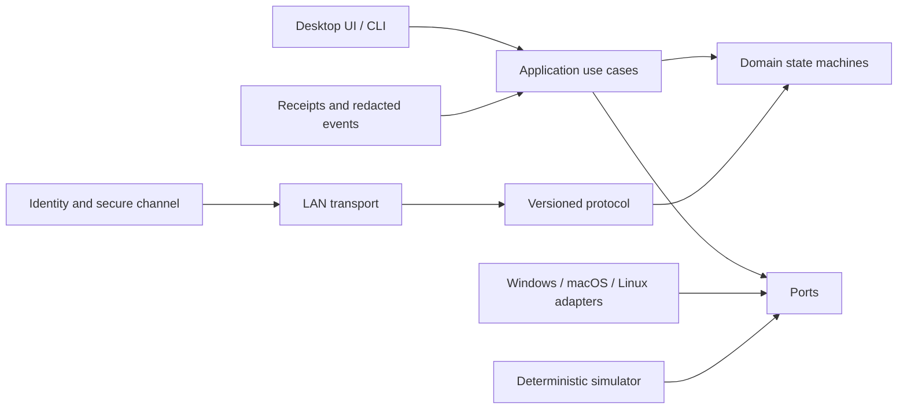
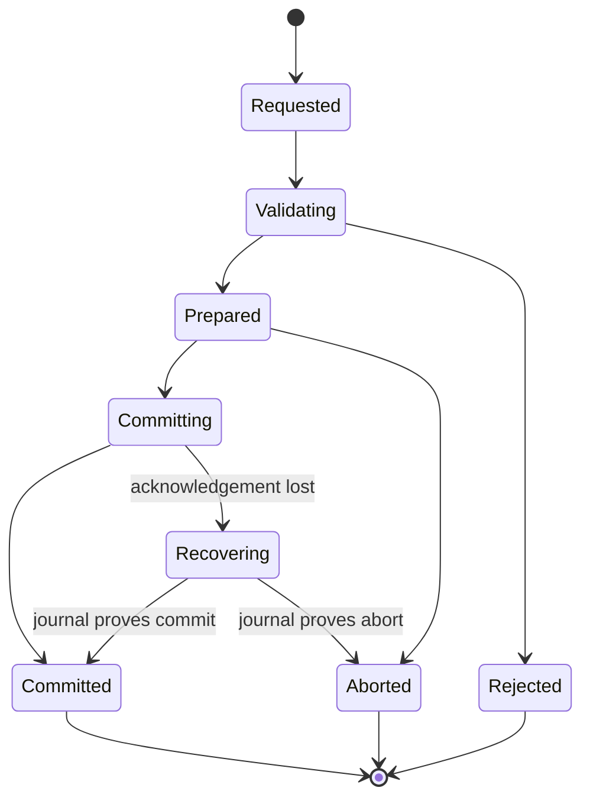

# Flowspan v1 Technical Design

Status: accepted baseline derived from approved product requirements

Requirements: `specs/v1/requirements.md`

## 1. Design principles

1. The domain core knows Activities and transactions, never windows or sockets.
2. Safety is monotonic: loss of certainty removes input/capture authority and
   never silently broadens a capability.
3. Semantic adapters are preferred; Remote Window is a named separate path.
4. Every remotely initiated change is authorized, idempotent, observable, and
   recoverable.
5. Platform APIs live behind narrow interfaces with deterministic fakes.
6. Direct LAN operation is complete without an online account. Relay is a
   future transport, not an assumption embedded in the protocol.

## 2. Technology baseline

Flowspan uses C# on .NET 10 LTS for the protocol, domain, services, platform
adapters, test utilities, and desktop shell. The initial slice has no UI or
native-framework dependency. A later desktop project may use Avalonia while
depending only on application ports. See `docs/adr/0001-dotnet-single-language.md`.

Repository-wide settings pin nullable reference types, deterministic builds,
warnings as errors, analyzers, and a formatting check. Production core projects
use only the .NET base class libraries until an external dependency has an ADR.

## 3. System boundaries



Dependencies point inward. `Domain` has no filesystem, clock, randomness,
network, UI, or platform dependency. `Application` receives those facilities as
ports. Wire DTOs are translated at the protocol boundary rather than becoming
domain entities.

### Planned projects

| Project | Responsibility |
| --- | --- |
| `Flowspan.Domain` | Activities, capabilities, operations, swap state, driver leases, invariants |
| `Flowspan.Protocol` | Version envelopes, message DTOs, validation, negotiation, deterministic codec |
| `Flowspan.Application` | Handoff/move/swap/mirror use cases, authorization, journaling, recovery |
| `Flowspan.Security` | device identity, pairing transcript, key derivation, encrypted frames, trust store ports |
| `Flowspan.Transport` | framed connections, LAN discovery ports, reconnection/backoff |
| `Flowspan.Platform` | portable contracts and capability/degradation model |
| `Flowspan.Platform.Windows` | Windows-specific capture, input, protected-surface, credential-store implementations |
| `Flowspan.Platform.MacOS` | macOS-specific implementations and permission probes |
| `Flowspan.Platform.Linux` | Wayland-first portal and X11 fallback implementations |
| `Flowspan.Diagnostics` | structured events, receipts, redaction, export |
| `Flowspan.Simulator` | two-node executable and deterministic fault injection |
| `Flowspan.Desktop` | accessible desktop composition root and UI |

The first slice creates only the projects required to execute and test its
behavior. Empty platform assemblies are not created for appearance.

## 4. Core model

### Activity

An Activity has a stable ID, kind, origin device, current placement, lifecycle
state, sensitivity label, revision, and a validated descriptor. Descriptor
payloads are typed JSON objects with an adapter-owned schema identifier and
size limit. The generic core treats their contents as opaque after validation.

Initial semantic kinds:

- `web.page/v1`: canonical URL and optional title; target opens the URL using
  the user's selected/default browser.
- `file.reference/v1`: content digest, display name, media type, size, and an
  optional transfer offer; target never trusts a source path.
- `workspace.note/v1`: UTF-8 plain text with a conservative size limit, used by
  the simulator and as a portable reference adapter.

Remote Window is not an Activity descriptor kind. It is a presentation mode
whose host remains the source device.

### Operation lifecycle

Every request has `OperationId`, `CorrelationId`, initiator, participants,
deadline, requested capabilities, and expected Activity revisions.



Terminal outcomes are immutable. The operation journal provides idempotency;
the same operation ID and same request returns its stored outcome, while reuse
with different content is rejected as a conflict.

### Move and replace

A move captures and validates the source, prepares the target, commits target
resume, records acknowledgement, and only then asks the source adapter to close
or suspend. If source cleanup fails, the operation is `CommittedWithWarning`
and the receipt reports a duplicate Activity; target success is not rolled back
by destructively guessing.

Replace creates a bounded undo capsule through the target adapter before
commit. Adapters that cannot preserve enough state must say so before the user
confirms the replacement.

### Atomic swap

Swap uses a coordinator plus durable endpoint journals:

1. validate identities, capability grants, expected revisions, and descriptor
   schemas;
2. prepare both endpoints and obtain expiring reservation tokens;
3. durably record the commit decision at the coordinator;
4. send commit with the decision digest to both endpoints;
5. retry until both acknowledge or recovery reads the decision record.

An endpoint never commits without a matching reservation and authenticated
commit decision created no later than the reservation deadline. Passing the
deadline forbids a new commit decision but does not let a prepared endpoint
guess `abort`: recovery must obtain the durable commit/abort decision. A timely
commit decision remains applicable if delivery arrives later. This blocking
trade-off preserves atomicity and is deliberately closer to a small two-phase
commit protocol than two independent moves.

### Mirror and driver lease

Mirror keeps authoritative execution on one host. Video/audio/cursor data are
separate bounded media channels; control messages use the reliable operation
channel. A driver lease includes Activity ID, holder device, monotonic epoch,
expiry, and permitted input classes. The host accepts input only for the highest
known unexpired epoch and revokes the old lease before issuing the next epoch.
Emergency stop increments the epoch, clears all leases, and closes media.

## 5. Protocol

The control protocol is framed canonical JSON for v1. Readability and fixture
stability outweigh wire density for low-volume control traffic. Binary media
and file content use separate chunk frames and never enter structured logs.

Each envelope includes:

```text
magic, protocolVersion, messageType, messageId, correlationId,
senderDeviceId, sentAt, ttl, bodyDigest, body
```

Decoders impose a maximum frame size, maximum nesting depth, known-version
range, strict required fields, and message-specific limits. Unknown optional
fields are ignored; unknown message types and required capabilities are
rejected. Version negotiation precedes operation messages and chooses the
highest common major/minor feature set. See
`docs/adr/0002-versioned-local-protocol.md`.

## 6. Discovery, transport, and reconnection

`IPeerDiscovery` produces signed, short-lived peer offers containing device ID,
display name, protocol range, connection endpoint, nonce, and identity-key
fingerprint. No Activity names or capabilities are advertised. The production
LAN implementation will use an interoperable mDNS/DNS-SD service record after
the discovery spike; tests use an in-memory discovery bus.

`IPeerTransport` exposes ordered duplex byte streams. Direct TCP is the initial
transport. A length-prefixed frame reader provides partial-read, size, timeout,
and cancellation handling. Reconnect uses bounded exponential backoff with
jitter supplied by an injectable source; trust is reauthenticated and active
capabilities are not assumed to survive a new secure session.

## 7. Identity, pairing, and encryption

Each device owns a long-lived P-256 ECDSA identity key stored via an
`ISecretStore`. Pairing exchanges public keys over an unauthenticated candidate
channel, signs the transcript, and displays a short authentication string
derived from the full transcript. Trust is persisted only after local
confirmation on both endpoints.

Each connection performs ephemeral P-256 ECDH, authenticates its transcript
with the paired identity keys, derives directional AES-256-GCM keys using
HKDF-SHA-256, and assigns monotonically increasing nonces. Headers needed for
routing are authenticated as associated data. Key epochs rotate before nonce
or byte limits and old epochs are erased. This application layer keeps payloads
end-to-end protected when a future byte-forwarding relay is introduced.

Cryptographic formats, limits, and test vectors must be frozen in a dedicated
security ADR before production pairing is enabled. The first simulator slice
uses an explicit fake secure channel and cannot be presented as production
security.

## 8. Authorization and sensitive surfaces

Authorization evaluates peer identity, capability, direction, Activity scope,
sensitivity, current secure-session identity, and local platform state. Default
capabilities are denied. Suggested independent grants are:

`activity.offer`, `activity.receive`, `activity.replace`, `mirror.view`,
`mirror.drive`, `file.receive`, and `scene.apply`.

All product trust mutations and active peer-session registrations pass through
one coordinator boundary. Revocation or capability downgrade first removes the
trust/session eligibility under the same lock, then invokes every affected
session stop outside the lock before returning. A stop failure is reported only
after all affected sessions have received a stop request. This ordering prevents
a concurrent session from being admitted with revoked authority. The coordinator
accepts the `ITrustStore` authority; both the degraded in-memory store and the
payload-backed persistent implementation stay behind this boundary rather than
exposing an independent product mutation path. Local coordinator shutdown first
blocks new admission, removes every registration, and awaits all session stops.

Platform adapters continuously expose a `ProtectionState`. Unknown or stale
protection state fails closed for capture and remote input. The global emergency
stop is implemented in the platform process as well as the application layer so
it does not depend on a healthy peer or UI event loop.

## 9. Persistence and diagnostics

ADR 0006 replaces the provisional plain-JSON trust plan with a bounded,
canonical binary snapshot behind `ITrustStore` and `ITrustPayloadStore`. A
mutation is published in memory only after the opaque platform-protected payload
has been atomically replaced; corrupt or unsupported startup data fails closed.
The core codec and repository are implemented, while Windows, macOS, and Linux
trust-payload adapters remain explicit platform gates. Private keys never use
this trust repository. Activity history and Scene persistence still require a
separate format/migration decision before production use.

Domain transitions emit structured events with stable event IDs and reason
codes. Redaction happens before sinks receive fields. Receipts and diagnostics
contain hashes, sizes, kinds, and state transitions—not descriptor payloads,
raw keystrokes, filenames marked sensitive, or key material.

## 10. Desktop and platform plan

- **Windows**: Windows Graphics Capture for output where available, SendInput
  only under an active driver lease, UI Automation/accessibility adapters, and
  Windows Credential Manager/DPAPI for secrets. Secure desktop and protected
  content fail closed.
- **macOS**: ScreenCaptureKit, accessibility permission for input, Keychain for
  secrets, and secure-input/protected-window probes. Permissions are requested
  at feature use.
- **Linux**: Wayland via xdg-desktop-portal/PipeWire and RemoteDesktop portal;
  X11 is an explicit weaker fallback. Secret Service stores identity material.
  Desktop/portal differences are reported as capabilities, not hidden.

Platform calls are thin adapters. Contract tests run everywhere; native tests
are tagged and executed only on the matching CI runner or documented manual
hardware environment.

## 11. Verification

The deterministic simulator supplies fake clock, IDs, transport, adapters,
journal, trust store, and fault schedule. The first slice must demonstrate:

1. semantic handoff between two nodes;
2. move closes source only after target acknowledgement;
3. lost acknowledgement is safely retried;
4. duplicate requests do not duplicate Activities;
5. swap failure before decision changes neither endpoint;
6. recorded commit recovers after disconnect;
7. expired driver leases reject input;
8. structured receipts omit descriptor content.

Full layers and CI evidence are defined in `docs/testing/test-strategy.md` and
`docs/release/v1-release-criteria.md`.

## 12. Open implementation decisions

These do not alter the approved product direction and will be resolved by
spikes/ADRs:

- DNS-SD library versus a small platform abstraction over native responders;
- persistence format after the simulator slice;
- Avalonia version and packaging/signing pipeline;
- per-platform Remote Window codec and capture implementation;
- precise undo retention defaults and Activity descriptor size budgets.
