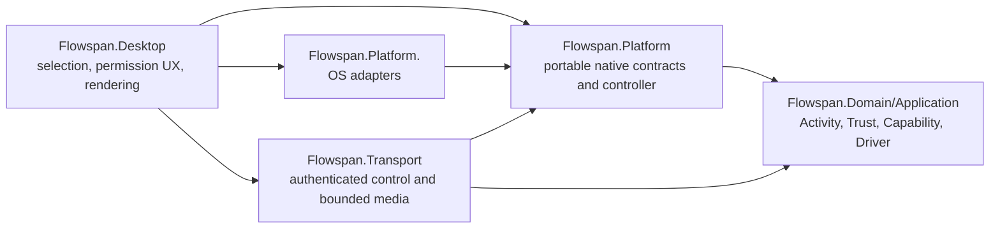

# Native Remote Window Design

Status: portable contract slice implemented; production native adapters pending

Requirements: NR1-NR10

## 1. Delivery shape

The native work extends the existing portable controller instead of replacing
it. Domain and protocol code continue to own Activity identity, Capability,
Driver Lease, protection policy, state transitions, encryption, replay checks,
and media budgets. Platform projects own only local operating-system resources.
The Desktop project composes those two layers and owns presentation.

The implementation proceeds in vertical slices:

1. freeze the native source, permission, protection, capture, input, and local
   Emergency Stop contracts with deterministic fakes;
2. compose one production control path over the existing authenticated peer
   connection and one bounded media path;
3. deliver macOS, then Windows, then Linux platform adapters;
4. add participant rendering and packaged real-machine evidence per platform.

No platform becomes generally available because another platform's adapter is
complete. Readiness is computed per operation and per current machine.

## 2. Dependency direction

Platform projects must not reference Desktop or Transport. They return typed
facts, opaque local tokens, bounded frame buffers, and `LocalBoundaryResult`.
They contain no user-visible prose. Desktop adapts native permission facts to its
resource-backed presentation model. Transport never receives a native handle.

## 3. Ephemeral generic-window source

A platform source catalog enumerates only locally visible, policy-eligible
windows. It owns an in-memory registry from an unpredictable `NativeSourceToken`
to the native window/process instance and a monotonically increasing generation.
The process-local snapshot contains:

- token, generation, and an ephemeral Flowspan Activity ID used to bind only the
  live Remote Window session;
- bounded local display title and owning application label;
- current geometry revision;
- capture/input support and current protection classification.

Desktop projects each eligible snapshot into a dedicated Remote Window source
inventory with `SupportsSemanticResume=false`. It does not create an Activity
Descriptor or Activity Kind and does not insert the source into the Application
Activity catalog, Handoff, Move, Replace, Swap, Group, or Scene inventories. The
Activity ID is an ephemeral live-session binding, not a semantic descriptor.
Selection and Start carry the exact token/generation only inside the local
process. The wire continues to carry Activity ID, not the token or native handle.

The registry invalidates an entry when the window closes, its owning process
instance changes, geometry identity becomes ambiguous, or policy excludes it.
Its 128-state process bound counts both visible entries and removed states whose
use or callback drain is still pending; registration resumes only after retained
state drain completes.
The controller retains its own lease handle, so disposing a caller's selection
handle cannot silently detach a live safety subscription. Invalidation first
closes new use admission, then drains any generation-bound native use, publishes
the controller's `Unavailable` state, closes frame admission, and stops capture,
input, and participant sessions before an external source-close call returns.
The registry retains removed states until their drain completes, so concurrent
registration and registry disposal join the same invalidation. A re-entrant
close from an active native use or invalidation callback ancestry defers only
when the target already requires a wait; the original drainer or use-scope exit
completes it. This prevents cross-source circular waits while every top-level
external close still joins the drain. Per-invocation callback activity prevents
a stale copied execution context from bypassing a later drain. The portable v1
registry permits only a bounded display-name update in place. A change to owning
application, geometry, capture/input support, or protection is a
security-binding change: it closes new use admission under the registry lock,
removes the old catalog entry, drains its exact use and invalidation callbacks,
and returns a failed update so the platform enumerator must register a fresh
source. This conservative retirement prevents capture on one geometry while
input uses another; a future atomic native rebind requires a separate design.
When a different active source-use ancestry could make two display-only updates
wait on each other, `TryUpdate` returns false and restores use admission instead
of blocking. Titles are never identity.

## 4. Portable native contracts

`Flowspan.Platform` gains narrow contracts rather than one broad platform
service:

- `INativeRemoteWindowSourceCatalog` for bounded prompt-free enumeration and
  exact token/generation resolution;
- `INativeRemoteWindowPermissionBoundary` for prompt-free snapshots and explicit
  capture/input requests;
- `INativeRemoteWindowCaptureBoundary` implementing the existing capture gate
  plus bounded frame delivery and exact source binding;
- `INativeRemoteInputBoundary` implementing the existing input gate plus current
  geometry mapping;
- `INativeProtectionSource` publishing timestamped typed observations;
- `ILocalEmergencyStopRegistration` registering one independent local action.

Generic-window capture and input cross the native boundary with a process-local
`NativeRemoteWindowSourceUse`. It contains the opaque token, ephemeral Activity
and host IDs, owner and Session generations, source generation, and geometry
revision, but no title, application label, native handle, or process identity.
The token is ignored by JSON and every diagnostic projection. Platform adapters
must resolve the token and re-check every generation immediately before the OS
capture call or first input event; a whole input batch fails before injection if
the geometry revision no longer matches. The controller acquires a source- and
geometry-bound use scope immediately before capture admission or input and holds
it across the complete native boundary call. Source invalidation and any
security-binding metadata change close new admission before waiting for an
existing scope to drain. The controller re-checks after each boundary as cleanup
evidence, not as permission to undo partial native work.

Callbacks include an owner generation and never expose native exception text.
Frame delivery uses an owned bounded buffer that must be disposed by the
consumer. The controller wraps the destination in a source-, owner-, Session-,
geometry-, and sequence-bound sink with one in-flight delivery and one
latest-frame pending slot. Wrong, stale, non-advancing, replaced, late, or
downstream-failed frames are disposed exactly once. Delivery crosses the
destination only while the exact Session is Active, capture is confirmed, and
the current protection observation is fresh Safe. A blocked or failed protection
pause therefore drops late frames without closing the exact binding; a confirmed
Safe resume can admit a later advancing sequence. Predicate failure or a
destination exception emits one typed terminal fault, moves the controller to
`Unavailable`, and stops capture, input, and participant gates. `CloseNow`
rejects new and pending frames without waiting for a blocked destination;
ordinary Stop drains an in-flight delivery after closing producers. Controller
disposal invoked from any frame callback closes immediately and defers final
resource release until the registered delivery exits. Top-level external
controller disposal joins every registered operation, including a blocked frame
delivery, before it returns. Concurrent external disposers first join the one
initial fail-close attempt and then a `NotStarted` / `InProgress` / `Completed`
finalization barrier, so no caller can observe final cleanup merely started and
release a borrowed boundary early. Fail-close and final cleanup retain
controller-local recursion tokens while also entering the shared drain-activity
chain. Controller operations, frame deliveries, protection and Emergency
callbacks, source uses, and source-invalidation callbacks all use that one
process-wide chain; every invocation becomes inactive when it exits.
Synchronous or `Task.Run` child disposal can therefore identify its active
parent activity. When a controller target actually has work that would require
waiting, any active shared ancestry defers the wait after fail-close. This
breaks same-kind and cross-component disposal cycles without weakening a
top-level external caller's drain guarantee. A copied context loses the
exemption when its original invocation exits and must join any later drain. The
last registered operation claims finalizer ownership under the same lock before
waking external waiters; this prevents an external finalizer from waiting on a
source callback that is itself trying to exit. New
source-invalidation callback admission closes with disposal before that final
zero-operation observation. The contract permits at most one active capture
source per local v1 runtime. The portable controller remains the only authority
for pause, resume, input, and stop decisions.

Frames and protection observations carry owner, Session, source, and applicable
geometry generations. Protection state commits before observer delivery.
Observer delivery is revision ordered, externally drained on disposal, and
bounded to eight queued notifications; overflow coalesces to `Unknown` rather
than allowing a newer Safe observation to erase an undelivered unsafe state.
Emergency Stop registration is one-shot and carries exact owner/Session
generations. Registration loss is a named fail-closed activation, a callback
cannot be replaced while it is running, and callback references are cleared on
trigger, loss, unregister, or disposal. Protection, Emergency Stop, source
invalidation, and frame-delivery drain checks track complete callback ancestry
through `ExecutionContext`. Each invocation uses a unique active token, so a
synchronous child worker can dispose an ancestor without waiting on its own
logical call stack, while a delayed worker from an older callback cannot bypass
a later callback's drain. Frame delivery uses a shared family owner plus a
per-delivery token. A sink defers only under active frame-delivery ancestry,
which prevents symmetric destinations from deadlocking. In a cycle with a
controller, protection source, Emergency registrar, or source registry, that
other component sees the frame activity and yields; the sink can then finish its
delivery. This direction preserves ordinary controller Stop, which must still
join its owned delivery. A top-level external sink or boundary disposer has no
active scope and waits for completion.

The existing controller currently accepts a semantic `ActivityInstance`. This
slice replaces that dependency with a bounded `RemoteWindowSourceReference`
containing Activity ID, optional semantic kind, display label, host Device, and
source generation. A compatibility factory may adapt an active semantic Activity,
but a generic native source has no descriptor or synthetic `remote.window/v1`
kind. Protocol 1.5 continues to bind the existing Activity ID field, so this
refactor changes no frozen wire fixture.

The controller owns its retained source lease, invalidation registration, and
bounded frame-sink lifetime. It borrows native capture/input implementations;
the production Desktop runtime owns those asynchronous native resources and
must dispose them only after controller quiescence during task 5.

## 5. Production Desktop runtime

`ProductionDesktopRemoteWindowService` owns one runtime generation containing:

- the exact selected native source lease;
- `RemoteWindowSessionController` and unpredictable Session ID;
- the current authenticated control endpoint;
- capture-to-encoder and decoder-to-renderer queues;
- protection subscription and local Emergency Stop registration;
- cancellation and complete asynchronous disposal.

Start order is strict: revalidate Activity/source, current Trust and Capability,
prompt-free permission, participant connection, renderer readiness, protection,
and Emergency Stop registration; create the controller and endpoint; then cross
native capture. Any failure unwinds in reverse order and retains no participant
or Driver authority.

The existing Desktop reducer consumes only controller snapshots and permission
facts. It does not infer native success from a task completing. Production
composition keeps `native_adapters_unavailable` until every mandatory host and
participant component for the selected role reports ready.

## 6. Authenticated control and media routing

The current Activity control session and Remote Window tracer each own a read
loop, so they cannot independently consume one authenticated TCP connection.
Production composition introduces one connection-owned dispatcher that routes
strict, version-gated message types to Activity/Replace/Swap/Scene or Remote
Window peers and exposes their outbound channels from the same registration.
Unknown types remain fatal. Capability alternatives admit a connection but do
not authorize an operation.

The media stream stays distinct from control keys, framing, counters, queues, and
rekey state as required by ADR 0022. Before physical media routing is implemented,
an ADR must freeze how a second authenticated stream declares its purpose and is
bound to one live control Session without parser ambiguity or a new unauthenticated
port. If that requires a wire change, it uses a new protocol minor version rather
than changing frozen 1.5 fixtures.

This decision gate is intentional: native capture may be developed and tested
behind the bounded frame sink, but production availability remains false until
the authenticated media route and participant renderer are composed.

## 7. Frame encoding and rendering

The first production codec is an independently framed, bounded intra-frame image
codec implemented through the already shipped Skia family. It is chosen for a
small, inspectable failure surface and frame-drop recovery; it is not a claim of
video-codec efficiency. A dependency/codec ADR must pin the direct package,
format, dimensions, quality ladder, alpha behavior, decoder limits, and physical
revisit threshold before code lands.

Capture writes to a capacity-one latest-frame queue. Encoding uses bounded pixel
dimensions and attempts a finite quality/scale ladder until the encoded image
fits the existing 16-chunk/1-MiB logical-frame ceiling. Failure drops the frame.
It never enlarges protocol limits or queues. The participant decodes into a
bounded buffer off the UI thread and swaps the latest complete bitmap on the UI
dispatcher. Stale Session, Activity, sequence, or renderer-generation frames are
discarded before presentation.

Audio remains unavailable until its capture, codec, consent, and renderer have
their own acceptance slice. Cursor may be embedded in the captured frame for the
first production slice; a separate cursor frame requires a later measured need.

## 8. Platform adapters

### Windows

The Windows project uses Windows Graphics Capture for the exact selected window,
`SendInput` for the closed input vocabulary, and native desktop/session checks to
classify lock or secure desktop. Capture-session closed events, access loss, and
protected-content uncertainty publish unsafe state. COM and frame-pool callbacks
are generation-bound and disposed on a dedicated owner.

### macOS

The macOS project uses ScreenCaptureKit for exact-window capture,
`CGPreflightScreenCaptureAccess`/`CGRequestScreenCaptureAccess` for capture TCC,
Accessibility trust plus CoreGraphics events for input, and
`IsSecureEventInputEnabled` as one fail-closed protection signal. ScreenCaptureKit
window sharing/protection facts and source loss supplement secure input.

Core C APIs use source-generated C# interop. ScreenCaptureKit is Objective-C and
block based; implementation must first prove that direct managed interop can own
callbacks and lifetimes without private ABI assumptions. Otherwise a minimal,
versioned, C-callable Swift shim is allowed only at that ABI boundary and requires
an ADR, deterministic build input, packaging, signing, and leak/crash tests. All
state and policy remain in C#.

### Linux

Wayland uses the ScreenCast and RemoteDesktop portals for user-mediated source
selection and input plus PipeWire for frames. Portal handles and PipeWire nodes
are session-scoped and never persisted. Portal closure or revocation stops the
runtime. X11 is a separately selected adapter with an always-visible security
degradation; no silent Wayland-to-X11 fallback is permitted.

## 9. Protection and Emergency Stop ordering

Native observers publish into a single generation-aware protection reducer. Any
exception, callback loss, stale timestamp, lock transition, secure input, source
loss, or protected-content uncertainty becomes unsafe before controller resume.
Only a newer Safe observation may attempt both native gate resumes.

The local Emergency Stop registration is established before capture admission.
Its callback performs only bounded synchronous gate closure and signals deferred
cleanup. Frame admission closes without waiting for encoder, transport, or
renderer work; capture, input, and participant gates then close immediately.
Ordinary stop and disposal close those producers before draining an in-flight
frame delivery. Emergency Reset never waits on a blocked destination: it returns
`native_frame_delivery_drain_pending` and remains stopped until a later retry can
confirm the old delivery drained. A stale native lease is terminal for that
controller and cannot be reset to Idle. The Emergency callback does not allocate
frames, await, invoke the UI dispatcher, or contact the peer. Registration
conflict or loss blocks or stops sharing. Disposal drains the callback owner
before releasing native handles.

## 10. Testing and evidence

Each platform adapter has three evidence levels:

1. portable contracts with injected native calls on every CI OS;
2. matching-host native API smoke that verifies prompt-free facts and safe
   create/stop/dispose without manufacturing permissions;
3. packaged real-machine scenarios with explicit grant/deny/revoke and observable
   capture/input/protection/Emergency Stop results.

Fault tests cover every native call and callback boundary, cancellation,
late-generation callbacks, resource ceilings, and partial cleanup. Media tests
include hostile dimensions, compressed bombs, malformed frames, backpressure,
and UI disposal. Physical tests record machines, OS/compositor versions,
permissions, devices, network, package digest, exact commit, and limitations.

Hosted runners may prove only the native calls they actually execute. A runner
without an interactive desktop or permission grant remains contract evidence.
