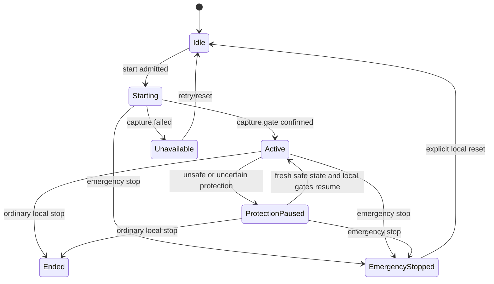

# Remote Window and Mirror Control Design

Status: approved portable control plane and frozen protocol 1.5/1.6 contracts;
protocol-1.7 Preparation codec and managed-session candidate implemented;
portable/headless Desktop workflow complete with exact-commit hosted evidence;
production Preparation composition, native adapters, and physical evidence
pending

## Design summary

`RemoteWindowSessionController` owns the live safety state for one Activity on
its execution host. It composes the existing immutable `MirrorSession` and
`DriverLease` domain model with current Capability lookup, protection policy,
capture control, remote-input injection, and local session-disconnect ports.

The controller lives in `Flowspan.Platform`, the existing portable platform and
safety layer. That project already depends inward on `Flowspan.Application` and
`Flowspan.Domain`; placing the controller there avoids an Application -> Platform
cycle and keeps native projects as thin implementations of narrow local ports.
No native API enters Domain or Application.

The live state is intentionally memory-only. A process restart removes capture,
transport keys, participants, and Driver authority rather than reconstructing a
possibly stale sharing session.

## Public control surface

The portable slice introduces these conceptual interfaces and models:

```csharp
public interface IMirrorAuthorizationSource
{
    CapabilityGrant GetCurrentGrant(DeviceId peerDeviceId);
}

public interface IRemoteWindowCaptureBoundary
{
    ValueTask<LocalBoundaryResult> StartAsync(...);
    LocalBoundaryResult PauseNow(MirrorPauseReason reason);
    LocalBoundaryResult ResumeNow();
    LocalBoundaryResult EmergencyStopNow();
    LocalBoundaryResult StopNow();
}

public interface IRemoteInputBoundary
{
    ValueTask<LocalBoundaryResult> InjectAsync(
        RemoteInputBatch batch,
        CancellationToken cancellationToken);
    LocalBoundaryResult PauseNow(MirrorPauseReason reason);
    LocalBoundaryResult ResumeNow();
    LocalBoundaryResult EmergencyStopNow();
    LocalBoundaryResult StopNow();
}

public interface ILocalSharingSessionBoundary
{
    LocalBoundaryResult DisconnectPeerNow(DeviceId peerDeviceId);
    LocalBoundaryResult DisconnectAllNow();
}
```

Every `*Now` member is a local fail-closed gate operation, not remote protocol.
Its implementation must synchronously prevent new frames/input/session traffic;
resource disposal may continue internally. The type intentionally has no peer
acknowledgement method.

`LocalBoundaryResult` is either confirmed, already applied, or failed with one
validated reason code. It contains no exception, payload, or peer text.

The controller exposes start, join/update role, transfer Driver, inject input,
reconcile current Capability, apply protection observation, disconnect peer,
refresh expired lease, ordinary stop, emergency stop, and explicit local reset.
Each response contains a `RemoteWindowSharingSnapshot` or a bounded reason code.

## Live state



`MirrorSession` remains the authority source once start is active. The wrapper
state represents capture admission and protection pause, which are not Driver
Lease states. The sharing snapshot always derives from one locked copy of both.

Start is two-phase and session-generation bound. It publishes `Starting`, awaits
local capture admission, records admission confirmation for that generation,
then publishes `Active` only if no Emergency Stop or protection block won the
race. A Safe protection observation received before admission confirmation stays
blocked and does not call either Resume gate. If Emergency Stop occurs while
Start is pending, the latch and state change synchronously; a late successful
Start invalidates any earlier capture-stop proof, is immediately halted, and
cannot publish `Active`. Only successful late cleanup for the current stop and
session generations can confirm capture stopped again. A late Start also
reconciles the latest monotonic protection observation rather than publishing
from the observation that originally admitted the attempt.

## Serialization and preemption

Normal operations use one `SemaphoreSlim` to serialize capture start, join,
role change, Driver transfer, input injection, disconnect, expiry refresh, and
ordinary stop. State reads and the emergency/protection fast paths use a short
private lock.

Every normal caller registers a lifetime lease before waiting for the semaphore,
rechecks disposal after acquisition, and releases that lease after releasing the
gate. Dispose first publishes its fail-closed state, rejects post-close work, and
waits for every registered waiter/owner before disposing synchronization. A
caller admitted before close therefore cannot cross the boundary after Dispose's
final check or release an already disposed semaphore.

Input holds the normal-operation gate from its final authorization/protection/
epoch check through the local injection call. Therefore a normal transfer cannot
publish a new Driver while an older input operation is still being admitted.

Emergency stop never waits for the normal-operation gate. Under the state lock
it activates `EmergencyStopLatch`, transitions `MirrorSession` through
`EmergencyStop`, and publishes the higher epoch before calling the three local
`*Now` boundaries. Protection blocking follows the same fail-closed ordering:
state first denies input, then synchronous local capture/input gates are paused.

## Authorization and participant reconciliation

The host is always the safe owner and local driver-eligible participant.

| Requested/effective role | Required current grant |
| --- | --- |
| View-only | `mirror.view` |
| Driver-eligible | `mirror.view` and `mirror.drive` |
| Driver transfer/input | `mirror.view` and `mirror.drive` re-read at use time |

Adding a peer uses no cached preview authorization. Reconciliation has closed
behavior:

- both grants current: retain DriverEligible;
- view current, drive absent: transfer any peer-held lease to the host with a
  higher epoch, then retain the peer ViewOnly;
- view absent: remove the participant, return any peer-held lease to the host,
  and locally disconnect that peer;
- host: never read from peer Trust and never remove/downgrade.

Participant removal and authority revocation commit before the local peer
disconnect. If that boundary fails or throws, a peer-scoped pending-disconnect
fact survives after the participant is absent. Both explicit disconnect and
Capability reconciliation recognize that fact and retry the boundary without
re-adding the participant; only confirmation clears it. Restoring Capability
does not bypass cleanup: admission of that same peer returns
status `BoundaryFailed` with reason `peer_disconnect_pending` until an explicit
disconnect or reconciliation confirms the pending boundary. A terminal or
otherwise inactive lifecycle prevents further peer-specific retry, and the next
Start clears obsolete pending facts before creating new live-session state.

Active participants and pending-disconnect facts consume one shared 16-slot
session budget: the host, every active peer, and every pending cleanup each
consume one slot. A re-authorized pending peer is rejected until its cleanup
confirms; a different new peer is rejected before mutation only when the shared
budget is full. A pending slot is released only by confirmed cleanup or
establishment of the next session generation. Rejection does not call capture,
input, or session boundaries.

## Portable input contract

`RemoteInputEvent` is a discriminated, immutable value for HID key, normalized
pointer move, pointer button, or bounded two-axis scroll. Factories enforce the
valid fields for each kind. `RemoteInputBatch` contains 1-64 events and makes a
defensive copy. It intentionally carries no text, process handle, native window
handle, or platform payload.

An input attempt supplies peer Device ID, lease epoch, and batch. Before calling
the port, the controller checks:

1. emergency latch and active session state;
2. participant and DriverEligible role;
3. current `mirror.view` and `mirror.drive`;
4. fresh safe `ProtectionSnapshot`;
5. exact current unexpired Driver Lease epoch.

Only an `Allowed` decision reaches `IRemoteInputBoundary`. The batch is never
included in the result.

## Protection control

The existing `ProtectionKind`, `ProtectionSnapshot`, and `RemoteInputPolicy`
remain the portable decision vocabulary. A snapshot older than 500 ms, more than
50 ms in the future, Unknown, SensitiveWindow, SecureInput, or ProtectedContent
is blocked.

Applying a blocked observation first publishes `ProtectionPaused`, then calls
capture and input `PauseNow`. The result records each local confirmation. A
boundary failure leaves the session blocked and explicitly unconfirmed; it does
not claim capture is blank.

If a stale protection operation crosses into a terminal lifecycle, cleanup calls
capture Stop, input Stop, and local session disconnect. The protection result
retains all three boundary results, including `SessionBoundary`, so a failed
disconnect cannot be reported as ordinary invalid state or silently discard the
only provenance for a possibly live session.

A fresh Safe observation calls both `ResumeNow` gates. `Active` is published
only if both confirm. If either resume fails, both gates receive a fail-closed
Unknown pause so a partially resumed capture or input path cannot remain open;
the operation still reports its original boundary failure and an unconfirmed
blocked state. Native capture adapters must also continuously apply platform
protection independently because controller polling alone cannot prove
frame-by-frame safety.

Every accepted observation advances a monotonic protection revision. A pause or
resume boundary result may publish a stable state only while its revision is
still current. A superseded operation re-applies the latest target; same-thread
boundary re-entry records the new observation for the outer reconciler instead
of recursively opening another boundary chain. Reconciliation is limited to
eight attempts, after which both gates receive an Unknown pause and the session
remains blocked with capture explicitly `Unconfirmed`, even when that final pause
call itself succeeds. Emergency Stop is checked after each re-entrant boundary
and is re-applied if a stale protection operation ran after it; the reassertion
result retains capture, input, and session confirmation independently.

## Emergency stop and ordinary stop

Emergency stop is synchronous and non-cancellable. It performs:

1. activate the local latch;
2. revoke the Driver Lease through a higher epoch and publish EmergencyStopped;
3. call capture `EmergencyStopNow`;
4. call input `EmergencyStopNow`;
5. call local session `DisconnectAllNow`.

All boundary calls run even when an earlier call fails or throws. Throws become
`local_boundary_exception` for only that boundary. The result separately names
capture, input, and session confirmation. Repetition preserves the first stop
epoch and invokes all three local boundaries without restoring authority. Every
attempt is counted against its stop generation before the boundaries run. Each
attempt merges successful capture, input, and session confirmations into the
current stop/session generation. Its returned result projects those accumulated
confirmations, so an already confirmed boundary remains successful when a later
invocation of that boundary fails. Reset returns
`emergency_stop_in_progress` while any attempt in that generation remains, then
accepts a later retry only after all attempts finish and the merged confirmations
for that same session generation are complete; a later session cannot reuse them.

Ordinary stop is also local and closes all three boundaries, but it serializes
with normal work and ends the session. Explicit reset after emergency stop only
returns the controller to Idle and clears the latch after every local boundary
is confirmed stopped. It does not restart capture or restore participants.

## Evidence and remaining layers

Portable unit/integration tests use public controller methods and deterministic
ports. They prove ordering and behavior but not operating-system behavior.

Delivered portable layers include protocol-1.5 authenticated control and a
purpose-separated bounded encrypted media stream with deterministic
backpressure/resource ceilings. Remaining slices add:

- Windows Graphics Capture, SendInput, secure desktop, protected capture, and a
  local emergency hotkey;
- ScreenCaptureKit, Accessibility/TCC, secure input, and protected-window probes;
- Wayland portal/PipeWire/RemoteDesktop and explicit X11 degradation;
- production codecs/rendering and real-machine accessibility/physical-device
  evidence.

No portable test, hosted runner, or fake closes those native/manual gates.

## Desktop Remote Window workflow

The Desktop adds a dedicated `RemoteWindowWorkspaceViewModel` rather than
folding live sharing state into semantic Activity operation receipts. A narrow
`IDesktopRemoteWindowService` supplies the latest bounded
`RemoteWindowSharingSnapshot`, a stable unavailable reason when no native
composition exists, a change notification, synchronous local Emergency Stop,
and one asynchronous start method bound to an exact Activity ID, target Device
ID, and `ViewOnly` or `DriverEligible` role. The view model owns presentation
text, command enablement, UI dispatch, exception reduction, and service
lifetime; it never owns Driver authority or infers native success.

`ActivityWorkspaceViewModel` keeps semantic `Targets`/`SelectedTarget` separate
from `RemoteWindowTargets`/`SelectedRemoteWindowTarget`. The semantic inventory
continues to require `activity.receive`; it never supplies Mirror authority.
The Remote Window inventory is filtered for the current
`RemoteWindowTargetRole`: `ViewOnly` requires `mirror.view`, while
`DriverEligible` requires one current grant containing both `mirror.view` and
`mirror.drive`. Both inventories also require the current authenticated peer
projection. `WorkspaceShellViewModel` synchronizes that preview role from
`RemoteWindow.IsRemoteDrivingEnabled` and projects `SelectedActivity`,
`SelectedRemoteWindowTarget`, and the Activity service's explicit
`SupportsSemanticResume` result into the Remote Window view model.

The elected reconnect profile and shared inbound listener admit
`mirror.view` and `mirror.drive` as independent any-of alternatives alongside
the existing Activity control alternatives. This is connectivity admission,
not operation authority. A `mirror.drive`-only Trust Record can establish or
retain the encrypted idle channel but appears in neither Remote Window target
role because both require `mirror.view`. Removing one profile alternative keeps
the registered channel while another remains; removing the final alternative
drains it. `DesktopActivityRuntime` subscribes to the shared
`TrustSessionCoordinator.Changed` signal so a successful register, capability
update, or revoke immediately recomputes the inventory even when the connection
itself remains alive. The coordinator publishes only after the mutation gate is
released and isolates observer failures from the committed Trust mutation and
session drain.

When semantic resume is available, the band names Handoff or Move and does not
offer or execute Remote Window. Otherwise, the fallback band previews the exact
source title and purpose-qualified target, states that execution remains on the
source, and keeps its start command disabled until the source is active, capture
permission is granted, no other live session exists, and any selected remote
driving path also has input permission. Role, Trust, or connection changes
refresh the purpose-specific inventory and clear an ineligible selection before
another start can be admitted. Selection changes invalidate a prior
failure/result context. The service boundary must still re-read Activity, Trust,
Capability, protection, and authenticated-session state at use time; the
Desktop preview is not authority.

Public start callers may race, but the start gate winner revalidates the exact
selection, role, lifecycle, and admission permission before publishing its
in-flight context or crossing the service boundary. A queued loser neither calls
the service nor clears or relabels the winner's context. One admitted start
freezes its Activity, target, and participant role while the boundary runs. The
admitted target remains the displayed session target until an authoritative
inactive/Idle reset. A later selection or preview-role change affects only the
next request and cannot relabel the in-flight or active request or receive its
late result. The role change first refilters the next-request target inventory
and clears a selection that lacks the new role's capabilities. The admitted
DriverEligible role is tracked independently of the mutable preview checkbox; a
bounded snapshot's non-host DriverEligible participant supplies the same fact
for a session started outside the preview.
Start, Emergency Stop, and local reset command-result snapshots are reduced
before a follow-up service refresh, so a read failure cannot erase the newly
accepted safety state or remove Emergency Stop from a stoppable session.

The existing top sharing header is the persistent safety surface. Its status,
description, automation name/help, and Emergency Stop command derive from one
snapshot refresh. Starting, Active, ProtectionPaused, EmergencyStopped,
Unavailable, and inactive states use distinct text. The fixed header's visible
description and accessibility name include the accepted Activity title and
current Driver. The detail band exposes only Activity title/ID, capture state,
participant count, current Driver, lease epoch and expiry, protection kind, and
revision. It always states that execution remains on the source Device while
Remote Window is active.

Emergency Stop stays in the fixed header and is enabled only for Starting,
Active, or ProtectionPaused. The command calls the local service synchronously;
it never sends or awaits a peer acknowledgement. The result reports capture,
input, and session boundary confirmation separately. Adapter exceptions reduce
to a stable unconfirmed result and never expose exception text. Repeated
activation is disabled by the emergency-stopped snapshot.

Permission review uses a separate `IDesktopRemoteWindowPermissionService` so an
operating-system prompt cannot be confused with live sharing state. Its bounded
snapshot reports capture and input independently as `NotDetermined`, `Granted`,
`Denied`, `Revoked`, `Unsupported`, or `Unavailable`. The view model first opens
capture rationale, requires a local acknowledgement, then serializes one capture
request. Remote driving remains disabled until capture is granted. Enabling the
driving checkbox opens input/accessibility rationale but does not request input
permission; a second acknowledgement and explicit request are required.
Snapshot reads are prompt-free and bounded; a permission-change safety decision
uses the event's atomically cached state and never waits for a native prompt or
unbounded IPC before crossing a required local Emergency Stop.

The rationale shown before each request names the data exposed and the matching
operating-system privacy-settings revocation path. Denied and revoked states
disable the dependent capability and name a recovery action. Undefined enum
values, state-read failures, and request exceptions reduce to `Unavailable`
without exposing exception text. A request result is not authoritative: the
view model re-reads the adapter snapshot so an intervening revocation wins. On a
permission `Changed` callback, the snapshot is read and any required local
Emergency Stop boundary is crossed synchronously on the callback path before
permission or stop presentation is queued to the UI dispatcher. Capture
permission loss stops a stoppable or concurrently starting session. Input
permission loss does the same when a DriverEligible start/session may exist;
view-only work remains eligible after the stopped session is explicitly reset.

The UI presentation fields are not cross-thread authority. One immutable safety
reducer holds normalized permission, controller/safety generation, admitted role,
session-may-exist, Activity/revision watermark, authoritative inactive
provenance, and accepted snapshot. It is compared and replaced atomically under
`serviceBoundaryGate`; UI projection is generation checked and occurs only after
that gate is released. No PropertyChanged, command observer, dispatcher, or
service-generated inline callback may run while the safety gate is held. After
acquiring the Start gate, Start revalidates and publishes its admission fact
before crossing the service boundary. If revocation publishes first, Start is
rejected without crossing; if Start publishes first, the callback observes the
admitted role and crosses Emergency Stop before returning. Synchronous `Changed`
raised by the service is deferred until the outer service crossing releases the
gate, and the gate is never held while awaiting the asynchronous Start result.

Permission requests and Remote Window starts use separate gates, listen to both
caller and view-model lifetime cancellation while queued and executing, and
drain before their owning adapter is disposed. Disposal first performs a
synchronous local Emergency Stop whenever the reducer says a session may exist;
this happens before cancellation callbacks, event removal, or a Start drain can
block. It then starts asynchronous lifetime cancellation, removes subscriptions,
drains registered operations, and disposes both services while collecting every
failure. Concurrent callers join the same completion and failure. Operation
gates release in nested cleanup even when a presentation observer throws while
busy state is cleared. An external-boundary callback lease is registered before
publishing permission-busy and associated command notifications and remains
visible while synchronous observers run outside the safety gate. Disposal
requested by one of those observers excludes that current callback lease from
its drain, so it can complete without waiting on itself while unrelated callers
still join full cleanup.

A Start exception or caller cancellation uses its bound generation and locally
Emergency Stops any still-current unconfirmed stoppable session. Cancellation is
checked again after the asynchronous boundary returns, so a successful result
from a cancellation-ignoring service is not applied and its still-current
session is stopped. An authoritative inactive/Idle observation received before
a successful Start result also makes that returned session require fail-closed
cleanup. If the same controller has already started a replacement session, the
older result and cleanup proof are discarded instead and cannot stop or mutate
the replacement, including after that replacement reaches its own inactive
boundary. Returned-start cleanup is eligible only while its admitted safety
generation is still current or at the directly following authoritative inactive
boundary; any intervening replacement consumes another generation.

At the Shell boundary, disposal closes Activity-to-Remote-Window projection and
waits only for already admitted projection leases; the foreign selection call is
always outside the projection lock. Lifetime cancellation, Remote Window safety
teardown, and local-pairing safety teardown are initiated before awaiting any of
them, so one blocked child cannot delay another child's stop. Trust, identity,
Activity, and remaining dependencies are released only after those safety paths
finish. Local pairing publishes no observer callback while holding its lifecycle
gate, rejects a cancellation-ignoring session returned after close, and shares
one disposal completion across callers. If session cleanup fails, the runtime
retains the retiring owner, presents cleanup unconfirmed, and blocks re-enable;
queued post-disposal Trust projections exit without touching disposed state.

The snapshot reducer keeps one Activity/revision watermark across transient
service unavailability. Its compare-and-commit is atomic, so a concurrently
arriving lower revision cannot overwrite a committed higher revision. It rejects
stale recovery snapshots while preserving Emergency Stop for a last-known
Starting, Active, or ProtectionPaused session. Activity/revision acceptance runs
before the snapshot can elevate the safety role, reset Emergency Stop state, or
derive a permission-loss stop. A rejected older DriverEligible snapshot therefore
cannot contaminate an accepted current view-only session.
Every retained Activity, capture, participant, Driver/lease, protection, and
revision field is visibly marked `LAST KNOWN`; if no snapshot was ever accepted,
those fields are `Unknown` rather than synthetic stopped/zero/none values.
An authoritative null/Idle observation establishes a new controller generation
and permits a later same-Activity controller to begin at a lower revision; a
different Activity also establishes a new context. Command results and queued
Emergency Stop outcomes carry the generation and are discarded completely when
they belong to an older controller or replacement-session generation. The one
fail-closed exception is a successful Start result that returns after an
authoritative inactive/Idle observation but before any replacement starts; it is
synchronously stopped because capture may have crossed after the observation.
A controller snapshot in `Unavailable` after a failed start permits an
explicit retry-only local reset to Idle only after the controller has invoked
the local capture-stop boundary and that boundary confirmed; the accepted
snapshot must also report capture `Stopped`, no remote participant, and no
current Driver. Failed, throwing, or cancelled capture admission attempts run
that cleanup before returning or propagating cancellation. This includes an
adapter that ignores cancellation and returns successful admission after the
token is cancelled. A failed cleanup publishes `Unconfirmed`. Transient service
unavailability, a presentation-only snapshot claim, and any unconfirmed stop do
not satisfy the reset predicate. Unavailability alone never clears the stop
latch or watermark.

Production composition injects the explicit unsupported permission service
until platform tasks 6-8 provide matching native adapters. Hosted fakes prove
only Desktop ordering, cancellation, presentation, and accessibility; they are
not native permission evidence.

The visual design preserves the existing industrial/utilitarian Avalonia shell:
Graphite, Steel, Chalk, Safety Amber, and Signal Red tokens; condensed headings;
monospace state labels; the asymmetric local-device rail; and a full-width live
sharing band below the fixed header. Existing label tracking is intentionally
normalized to zero for predictable larger-text rendering. No nested cards,
color-only status, emoji, or new font/icon dependency is introduced.

## Protocol 1.5 authenticated control

Remote Window adds a new minor protocol feature rather than changing 1.4
semantics. `ProtocolFeatures.RemoteWindowMinimumVersion` is 1.5 and gates five
strict canonical message types:

| Message | Direction | Purpose |
| --- | --- | --- |
| `remote-window.admission` | participant to host | Request ViewOnly or DriverEligible admission to one pre-issued live Session ID. |
| `remote-window.driver` | participant to host | Request Driver authority for self from one exact last-known epoch and bounded duration. |
| `remote-window.input` | Driver to host | Submit one closed `RemoteInputBatch` under one exact current epoch. |
| `remote-window.disconnect` | participant to host | End that authenticated peer's participation in the exact live session. |
| `remote-window.state` | host to participant | Return or publish payload-free participant, Driver, protection, capture, status, and revision state. |

The message envelope binds negotiated version, authenticated sender, message and
correlation IDs, and TTL. Each body additionally binds the unpredictable live
Session ID, Activity ID, host/participant identities, and the operation-specific
epoch/deadline. The codec requires the exact field set. A state response repeats
the request action and correlation and names the intended participant, so a
valid encrypted frame cannot be replayed across a peer, Activity, session, or
pending command.

The host adapter is deliberately thin: it maps admission, Driver, input, and
disconnect requests to the existing public `RemoteWindowSessionController`.
The controller remains the only authority owner and therefore still performs
the current Capability, protection, lease, ordering, and local-boundary checks.
The transport never upgrades a denied wire request into authority.

Remote input remains low-volume reliable control traffic rather than media.
This preserves the existing serialized final authorization/protection/epoch
check through the native input boundary. Input results and state frames contain
only a decision/status, bounded reason code, state revision, participant count,
effective role, and current Driver metadata; they never echo events.

## Protocol 1.7 host-selected Preparation

ADR 0026 adds a host-selected pre-admission transaction without changing any
protocol-1.5 or 1.6 fixture. Protocol 1.7 gates two additional strict messages:

| Message | Direction | Purpose |
| --- | --- | --- |
| `remote-window.prepare` | host to participant | Propose one exact live Session/Activity/role and ask the participant to prepare media and rendering. |
| `remote-window.ready` | participant to host | Return one terminal ready or rejected result for that exact Prepare. |

Both bodies repeat Session, Activity, host, participant, role, and deadline.
Their envelope correlation is the Preparation transaction ID. Both also carry
the uppercase hexadecimal SHA-256 `prepareDigest`. Its UTF-8 canonical input is
the newline-separated domain `flowspan.remote-window.prepare.v1`, negotiated
major, negotiated minor, correlation ID, Session ID, Activity ID, host Device
ID, participant Device ID, canonical role, and UTC deadline Unix milliseconds,
with no trailing newline. A decoder recomputes the digest and compares the 32
decoded bytes in constant time before accepting the message. Ready adds only one
terminal boolean and one allowlisted bounded reason code.
The deadline and both wire send timestamps are canonical whole-millisecond UTC.
Writers truncate an observed sub-millisecond send time downward before deriving
the exact integral envelope TTL, without changing the deadline.
Their lexical spelling uses fixed-width date/time fields, literal `+00:00`, no
fraction for zero milliseconds, and the shortest millisecond fraction for a
nonzero value (`.001`, `.01`, `.1`, `.12`, or `.123` for 1, 10, 100, 120, or
123 milliseconds). `Z`, other offsets, redundant zeros, and sub-millisecond
spellings are rejected only for the new 1.7 messages; legacy readers remain
unchanged.

The source host owns all peer-relative Mirror authorization. It checks the grant
to the participant before Prepare, again before native capture, and again when
the controller adds that participant. The receiving participant checks the
current authenticated connection and Trust, local recipient identity,
non-revoked/non-stopping state, receiver policy, renderer, and media readiness.
It must not require its local `mirror.view` or `mirror.drive` grant to the host,
because that grant authorizes the opposite source direction. There is no
`remote-window.receive` Capability in v1.
The host retains a `Created` outbound reservation until the Prepare wire send
actually starts. Ready before that point is fatal. During `PrepareSending`, one
exact Ready success enters `ReadyBuffered` but is neither published to the caller
nor accepted by final Admission until the Prepare send commits against Stop and
deadline as `ReadyAcknowledged`. State and completion publish in the same lock;
an acknowledged result cannot be reversed by a later Stop or clock read. An
exact rejection is terminal and may close the connection while the local send is
still flushing without losing the rejected result. Prepare, Ready, and final
Admission each check the absolute deadline again at actual wire-send admission,
before invoking the connection, so delayed watchdog scheduling cannot expose an
expired frame.

```mermaid
sequenceDiagram
    participant H as Host runtime
    participant C as Authenticated control
    participant P as Participant runtime
    participant M as FSM1 media

    H->>H: Revalidate source, grant, permission, protection, E-stop
    H->>M: PrepareResponderRoute(Session, Activity)
    H->>C: remote-window.prepare
    C->>P: Validate and reserve exact pending Prepare
    P-->>C: Return read loop immediately; start owned worker
    P->>M: ConnectInitiatorAsync and verify acknowledgement
    P->>P: Prepare renderer
    P->>C: remote-window.ready(success)
    C->>H: Match digest, binding, deadline, connection generation
    H->>H: Revalidate, register safety owners, Start capture
    H->>H: Add exact participant with frozen role
    H->>C: remote-window.state Admission outcome
    C->>P: Establish known binding only from accepted final state
    P->>P: Open frame admission and rendering
```

The participant control handler performs only strict validation and bounded slot
reservation on the dispatch call. It starts an owned, deadline- and
lifetime-cancelled preparation worker and returns immediately so the single
connection read loop cannot deadlock on media or a later control response. Stop
and disposal cancel and join that worker. The worker uses the same process-level
authenticated media directory as the control handler and published listener,
plus a generation-bound peer media connector lease for the exact authenticated
connection. The route ID remains inside `FSM1`; it never enters control JSON.
The participant remains `Preparing` until Ready send actually starts. It rejects
Admission before that point, buffers at most one exact Admission while Ready is
sending, and invokes no final endpoint until the send succeeds. A failed send
discards the buffer and closes the connection.

Ready means only that the participant can receive this exact authenticated media
binding. It does not create the participant's known live-session binding. After
Ready success the host rechecks every mutable fact, registers protection and the
independent Emergency Stop, starts native capture with frame admission still
closed, and calls `AddParticipantAsync`. The existing correlated
`remote-window.state` becomes the final gate only when its action is Admission,
its outcome is Applied or AlreadyApplied, and its effective role matches the
frozen request. Only then does the participant record the known binding and open
rendering. No frame can leave the host before this gate.

Each authenticated control registration admits one Preparation because its
connection-owned media session can choose one route role. The host and
participant each retain an exact pending record and a bounded terminal tombstone
through the deadline or connection close. Unknown, duplicate, conflicting,
expired, or delayed messages are fatal rather than idempotently starting new
work. A well-formed local rejection produces Ready false; malformed or wrongly
bound traffic is not reflected.

Any terminal rejection or failure closes frame admission before reverse-order
cleanup. Once route-role selection occurred, cleanup consumes the media session
and closes the owning authenticated control connection; retry requires a fresh
handshake, media session, route, Session ID, and correlation. Cleanup attempts
renderer/queue, attachment/route, controller, protection, Emergency Stop, and
control owners even when an earlier stage fails, preserving simultaneous failure
identity locally without disclosing exception text.

## Purpose-separated bounded media

Media frames are available from protocol 1.5, while a production second ordered
duplex stream attaches only at protocol 1.6 or later to the already authenticated
control session. The authenticated handshake derives a second directional
AES-256-GCM frame session with HKDF context
`FLOWSPAN-REMOTE-WINDOW-MEDIA-V1`; it does not reuse control keys, counters, or
rekey state. An implementation may later replace the ordered media transport,
but must preserve the authenticated Session/Activity binding and budgets.

The plaintext media format is binary and independently strict:

```text
magic(4), format(1), kind(1), flags(1), reserved(1),
liveSessionId(16), activityId(16), sequence(8),
chunkIndex(2), chunkCount(2), payloadLength(4), payload(0..65536)
```

All integers are big-endian. Format 1 recognizes video, audio, and cursor.
Sequence is positive and monotonic per kind. Video admits 1-16 chunks with
zero-based indexes; audio and cursor admit exactly one chunk. Unknown kinds,
flags, reserved bits, trailing bytes, invalid coordinates, and wrong
Session/Activity bindings fail before payload publication. The outer encrypted
frame has its own bounded big-endian length and AEAD authenticates the complete
plaintext header and payload.

### Resource contract

| Boundary | Limit | Failure behavior |
| --- | ---: | --- |
| Media payload | 64 KiB | Reject before queue/encryption. |
| Video chunks/logical frame | 16 | Reject shape. |
| Audio/cursor chunks | 1 | Reject shape. |
| Per-peer outbound queue | 8 frames / 512 KiB | Return explicit backpressure; do not evict an accepted frame. |
| Per-session outbound queues | 128 frames / 8 MiB / 15 peers | Reject reservation before ownership transfer. |
| Per-peer receive rate | 512 frames/s / 32 MiB/s | Fault and close that media channel. |
| Accepted media write | 2 s default, 10 s maximum | Fault channel and release every queued reservation. |

The queue takes a defensive payload copy only after both peer and shared session
budgets reserve capacity. One worker preserves order. Reservations live through
the write and are released exactly once on success, failure, cancellation, or
dispose. Control and Emergency Stop do not wait for queue drain: closing the
media stream cancels the worker and causes later media admission to fail.

Structured diagnostics expose only kind, byte count, sequence, queue counters,
stable outcome, and stable reason. They exclude media bytes, raw input, keys,
Activity title/payload, native handles, and peer exception text.

## Task 4 test strategy

The tracer bullet freezes one admission frame, sends it through a real
authenticated protocol-1.5 loopback, and observes the controller's current
Capability decision in a strict state response. Incremental tests then add
Driver epochs, input non-echo, protection state, disconnect, wrong bindings,
unknown fields, deadline/replay behavior, and 1.4 rejection.

The media tracer bullet derives purpose-separated sessions from the same
authenticated transcript, sends one binary frame on a second loopback stream,
and proves exact payload recovery. Incremental tests cover tamper, hostile
length/rate, sequence/chunk shape, queue and shared-budget backpressure, blocked
write timeout, cancellation, disposal, and fault cleanup. This proves portable
authenticated framing and resource behavior only; it is not native capture,
codec, rendering, quality, or physical-device evidence.
