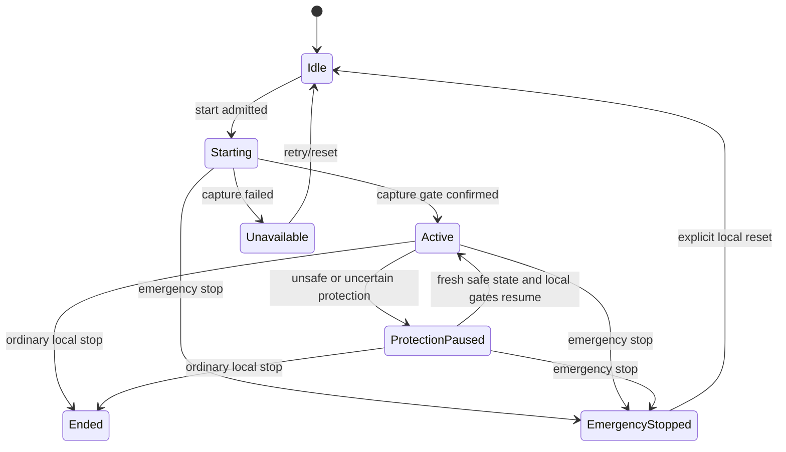

# Remote Window and Mirror Control Design

Status: approved portable control plane; protocol-1.5 control and bounded media
design frozen for Task 4

## Design summary

`RemoteWindowSessionController` owns the live safety state for one Activity on
its execution host. It composes the existing immutable `MirrorSession` and
`DriverLease` domain model with current Capability lookup, protection policy,
capture control, remote-input injection, and local session-disconnect ports.

The controller lives in `Flowspan.Platform`, the existing portable platform and
safety layer. That project already depends inward on `Flowspan.Application` and
`Flowspan.Domain`; placing the controller there avoids an Application -> Platform
cycle and keeps native projects as thin implementations of narrow local ports.
No native API enters Domain or Application.

The live state is intentionally memory-only. A process restart removes capture,
transport keys, participants, and Driver authority rather than reconstructing a
possibly stale sharing session.

## Public control surface

The portable slice introduces these conceptual interfaces and models:

```csharp
public interface IMirrorAuthorizationSource
{
    CapabilityGrant GetCurrentGrant(DeviceId peerDeviceId);
}

public interface IRemoteWindowCaptureBoundary
{
    ValueTask<LocalBoundaryResult> StartAsync(...);
    LocalBoundaryResult PauseNow(MirrorPauseReason reason);
    LocalBoundaryResult ResumeNow();
    LocalBoundaryResult EmergencyStopNow();
    LocalBoundaryResult StopNow();
}

public interface IRemoteInputBoundary
{
    ValueTask<LocalBoundaryResult> InjectAsync(
        RemoteInputBatch batch,
        CancellationToken cancellationToken);
    LocalBoundaryResult PauseNow(MirrorPauseReason reason);
    LocalBoundaryResult ResumeNow();
    LocalBoundaryResult EmergencyStopNow();
    LocalBoundaryResult StopNow();
}

public interface ILocalSharingSessionBoundary
{
    LocalBoundaryResult DisconnectPeerNow(DeviceId peerDeviceId);
    LocalBoundaryResult DisconnectAllNow();
}
```

Every `*Now` member is a local fail-closed gate operation, not remote protocol.
Its implementation must synchronously prevent new frames/input/session traffic;
resource disposal may continue internally. The type intentionally has no peer
acknowledgement method.

`LocalBoundaryResult` is either confirmed, already applied, or failed with one
validated reason code. It contains no exception, payload, or peer text.

The controller exposes start, join/update role, transfer Driver, inject input,
reconcile current Capability, apply protection observation, disconnect peer,
refresh expired lease, ordinary stop, emergency stop, and explicit local reset.
Each response contains a `RemoteWindowSharingSnapshot` or a bounded reason code.

## Live state



`MirrorSession` remains the authority source once start is active. The wrapper
state represents capture admission and protection pause, which are not Driver
Lease states. The sharing snapshot always derives from one locked copy of both.

Start is two-phase. It publishes `Starting`, awaits only local capture admission,
then publishes `Active` if no emergency stop won the race. If emergency stop
occurs while start is pending, the latch and state change synchronously; a late
successful start is immediately halted and cannot publish `Active`. A late start
also reconciles the latest monotonic protection observation rather than
publishing from the observation that originally admitted the attempt.

## Serialization and preemption

Normal operations use one `SemaphoreSlim` to serialize capture start, join,
role change, Driver transfer, input injection, disconnect, expiry refresh, and
ordinary stop. State reads and the emergency/protection fast paths use a short
private lock.

Input holds the normal-operation gate from its final authorization/protection/
epoch check through the local injection call. Therefore a normal transfer cannot
publish a new Driver while an older input operation is still being admitted.

Emergency stop never waits for the normal-operation gate. Under the state lock
it activates `EmergencyStopLatch`, transitions `MirrorSession` through
`EmergencyStop`, and publishes the higher epoch before calling the three local
`*Now` boundaries. Protection blocking follows the same fail-closed ordering:
state first denies input, then synchronous local capture/input gates are paused.

## Authorization and participant reconciliation

The host is always the safe owner and local driver-eligible participant.

| Requested/effective role | Required current grant |
| --- | --- |
| View-only | `mirror.view` |
| Driver-eligible | `mirror.view` and `mirror.drive` |
| Driver transfer/input | `mirror.view` and `mirror.drive` re-read at use time |

Adding a peer uses no cached preview authorization. Reconciliation has closed
behavior:

- both grants current: retain DriverEligible;
- view current, drive absent: transfer any peer-held lease to the host with a
  higher epoch, then retain the peer ViewOnly;
- view absent: remove the participant, return any peer-held lease to the host,
  and locally disconnect that peer;
- host: never read from peer Trust and never remove/downgrade.

Participant bounds are checked before mutation. Rejection does not call capture,
input, or session boundaries.

## Portable input contract

`RemoteInputEvent` is a discriminated, immutable value for HID key, normalized
pointer move, pointer button, or bounded two-axis scroll. Factories enforce the
valid fields for each kind. `RemoteInputBatch` contains 1-64 events and makes a
defensive copy. It intentionally carries no text, process handle, native window
handle, or platform payload.

An input attempt supplies peer Device ID, lease epoch, and batch. Before calling
the port, the controller checks:

1. emergency latch and active session state;
2. participant and DriverEligible role;
3. current `mirror.view` and `mirror.drive`;
4. fresh safe `ProtectionSnapshot`;
5. exact current unexpired Driver Lease epoch.

Only an `Allowed` decision reaches `IRemoteInputBoundary`. The batch is never
included in the result.

## Protection control

The existing `ProtectionKind`, `ProtectionSnapshot`, and `RemoteInputPolicy`
remain the portable decision vocabulary. A snapshot older than 500 ms, more than
50 ms in the future, Unknown, SensitiveWindow, SecureInput, or ProtectedContent
is blocked.

Applying a blocked observation first publishes `ProtectionPaused`, then calls
capture and input `PauseNow`. The result records each local confirmation. A
boundary failure leaves the session blocked and explicitly unconfirmed; it does
not claim capture is blank.

A fresh Safe observation calls both `ResumeNow` gates. `Active` is published
only if both confirm. If either resume fails, both gates receive a fail-closed
Unknown pause so a partially resumed capture or input path cannot remain open;
the operation still reports its original boundary failure and an unconfirmed
blocked state. Native capture adapters must also continuously apply platform
protection independently because controller polling alone cannot prove
frame-by-frame safety.

Every accepted observation advances a monotonic protection revision. A pause or
resume boundary result may publish a stable state only while its revision is
still current. A superseded operation re-applies the latest target; same-thread
boundary re-entry records the new observation for the outer reconciler instead
of recursively opening another boundary chain. Reconciliation is limited to
eight attempts, after which both gates receive an Unknown pause and the session
remains blocked. Emergency Stop is checked after each re-entrant boundary and
is re-applied if a stale protection operation ran after it.

## Emergency stop and ordinary stop

Emergency stop is synchronous and non-cancellable. It performs:

1. activate the local latch;
2. revoke the Driver Lease through a higher epoch and publish EmergencyStopped;
3. call capture `EmergencyStopNow`;
4. call input `EmergencyStopNow`;
5. call local session `DisconnectAllNow`.

All boundary calls run even when an earlier call fails or throws. Throws become
`local_boundary_exception` for only that boundary. The result separately names
capture, input, and session confirmation. Repetition preserves the first stop
epoch and retries unconfirmed local boundaries without restoring authority.

Ordinary stop is also local and closes all three boundaries, but it serializes
with normal work and ends the session. Explicit reset after emergency stop only
returns the controller to Idle and clears the latch after every local boundary
is confirmed stopped. It does not restart capture or restore participants.

## Evidence and remaining layers

Portable unit/integration tests use public controller methods and deterministic
ports. They prove ordering and behavior but not operating-system behavior.

Later slices add:

- authenticated control messages and bounded encrypted media with
  backpressure/resource ceilings;
- Windows Graphics Capture, SendInput, secure desktop, protected capture, and a
  local emergency hotkey;
- ScreenCaptureKit, Accessibility/TCC, secure input, and protected-window probes;
- Wayland portal/PipeWire/RemoteDesktop and explicit X11 degradation;
- Desktop permission preflights, persistent accessible sharing indicator, and
  real-machine accessibility/physical-device evidence.

No portable test, hosted runner, or fake closes those native/manual gates.

## Protocol 1.5 authenticated control

Remote Window adds a new minor protocol feature rather than changing 1.4
semantics. `ProtocolFeatures.RemoteWindowMinimumVersion` is 1.5 and gates five
strict canonical message types:

| Message | Direction | Purpose |
| --- | --- | --- |
| `remote-window.admission` | participant to host | Request ViewOnly or DriverEligible admission to one pre-issued live Session ID. |
| `remote-window.driver` | participant to host | Request Driver authority for self from one exact last-known epoch and bounded duration. |
| `remote-window.input` | Driver to host | Submit one closed `RemoteInputBatch` under one exact current epoch. |
| `remote-window.disconnect` | participant to host | End that authenticated peer's participation in the exact live session. |
| `remote-window.state` | host to participant | Return or publish payload-free participant, Driver, protection, capture, status, and revision state. |

The message envelope binds negotiated version, authenticated sender, message and
correlation IDs, and TTL. Each body additionally binds the unpredictable live
Session ID, Activity ID, host/participant identities, and the operation-specific
epoch/deadline. The codec requires the exact field set. A state response repeats
the request action and correlation and names the intended participant, so a
valid encrypted frame cannot be replayed across a peer, Activity, session, or
pending command.

The host adapter is deliberately thin: it maps admission, Driver, input, and
disconnect requests to the existing public `RemoteWindowSessionController`.
The controller remains the only authority owner and therefore still performs
the current Capability, protection, lease, ordering, and local-boundary checks.
The transport never upgrades a denied wire request into authority.

Remote input remains low-volume reliable control traffic rather than media.
This preserves the existing serialized final authorization/protection/epoch
check through the native input boundary. Input results and state frames contain
only a decision/status, bounded reason code, state revision, participant count,
effective role, and current Driver metadata; they never echo events.

## Purpose-separated bounded media

Media uses a second ordered duplex stream attached to the already authenticated
protocol-1.5 session. The authenticated handshake derives a second directional
AES-256-GCM frame session with HKDF context
`FLOWSPAN-REMOTE-WINDOW-MEDIA-V1`; it does not reuse control keys, counters, or
rekey state. An implementation may later replace the ordered media transport,
but must preserve the authenticated Session/Activity binding and budgets.

The plaintext media format is binary and independently strict:

```text
magic(4), format(1), kind(1), flags(1), reserved(1),
liveSessionId(16), activityId(16), sequence(8),
chunkIndex(2), chunkCount(2), payloadLength(4), payload(0..65536)
```

All integers are big-endian. Format 1 recognizes video, audio, and cursor.
Sequence is positive and monotonic per kind. Video admits 1-16 chunks with
zero-based indexes; audio and cursor admit exactly one chunk. Unknown kinds,
flags, reserved bits, trailing bytes, invalid coordinates, and wrong
Session/Activity bindings fail before payload publication. The outer encrypted
frame has its own bounded big-endian length and AEAD authenticates the complete
plaintext header and payload.

### Resource contract

| Boundary | Limit | Failure behavior |
| --- | ---: | --- |
| Media payload | 64 KiB | Reject before queue/encryption. |
| Video chunks/logical frame | 16 | Reject shape. |
| Audio/cursor chunks | 1 | Reject shape. |
| Per-peer outbound queue | 8 frames / 512 KiB | Return explicit backpressure; do not evict an accepted frame. |
| Per-session outbound queues | 128 frames / 8 MiB / 15 peers | Reject reservation before ownership transfer. |
| Per-peer receive rate | 512 frames/s / 32 MiB/s | Fault and close that media channel. |
| Accepted media write | 2 s default, 10 s maximum | Fault channel and release every queued reservation. |

The queue takes a defensive payload copy only after both peer and shared session
budgets reserve capacity. One worker preserves order. Reservations live through
the write and are released exactly once on success, failure, cancellation, or
dispose. Control and Emergency Stop do not wait for queue drain: closing the
media stream cancels the worker and causes later media admission to fail.

Structured diagnostics expose only kind, byte count, sequence, queue counters,
stable outcome, and stable reason. They exclude media bytes, raw input, keys,
Activity title/payload, native handles, and peer exception text.

## Task 4 test strategy

The tracer bullet freezes one admission frame, sends it through a real
authenticated protocol-1.5 loopback, and observes the controller's current
Capability decision in a strict state response. Incremental tests then add
Driver epochs, input non-echo, protection state, disconnect, wrong bindings,
unknown fields, deadline/replay behavior, and 1.4 rejection.

The media tracer bullet derives purpose-separated sessions from the same
authenticated transcript, sends one binary frame on a second loopback stream,
and proves exact payload recovery. Incremental tests cover tamper, hostile
length/rate, sequence/chunk shape, queue and shared-budget backpressure, blocked
write timeout, cancellation, disposal, and fault cleanup. This proves portable
authenticated framing and resource behavior only; it is not native capture,
codec, rendering, quality, or physical-device evidence.
